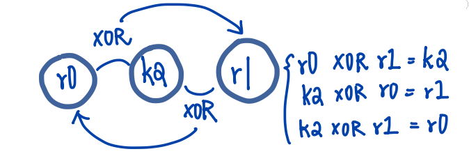

# Chapter 3 Introduction to Instruction Sets, v4T and v7-M
> This chapter is meant to provide a gentle introduction concepts behind, and rules for writing.

## 3.2 ARM, Thumb, and Thumb-2 Instructions
- ARM instructions
  - 32 bits wide
  - first to be used on older architectures
    - E.g  ARM7TDMI • ARM9 • ARM10 • ARM11
- Thumb instructions
  - 16 bits wide
  - a subset of ARM instructions
  - also work on 32-bit data

- Adding two 32-bit numbers together can be done in two ways:
    ARM instruction:    ADD    r0, r0, r2
    Thumb instruction:  ADD    r0, r2


## 3.3 Program 1: Shifting Data
> The following examples are using the ARM7TDMI & Keil directives
- The general format for most of the instructions:
  - instruction    destination, source, source

```
        AREA Prog1, CODE, READONLY
        ENTRY

        MOV     r0, #0x11    ; load initial value
        LSL     r1, r0, #1   ; shift 1 bit left
        LSL     r2, r1, #1   ; shift 1 bit left

stop    B       stop         ; stop program
        END
```
- **MOV**
  - normally used to shuffle data from one register to another.
  -  NOT used to load data from external memory into a register
- **stop B stop**
  - the last instruction tells the processor to branch to the branch instruction itself -> infinite loop
- **Instruction address**
  - Program Counter (PC) points to the address of the instruction being fetched.
  - NOTE: the addresses cascades depends on the ISA size (16/32 bits)
    - E.g 0x0004 -> 0x0008 -> 0x000C -> 0x0010

## 3.4 Program 2: Factorial Calculation (n!)
- This section introduces:
  - **Conditional execution**:
    - certain instruction may or may not be performed, depending on the result of another instruction.
  - **Setting flags**:
    - the CMP instruction tells the processor to update the flags in the **Current Program Status Register**.
  - **Change-of-flow instructions**:
    - a branch will load a new address(called a branch target) into the **Program Counter**, and execution will resume from this new address.

```
        AREA Prog2, CODE, READONLY
        ENTRY
        MOV     r6, #10     ; load n into r6
        MOV     r7, #1      ; if n=0, at least n!=1
loop    CMP     r6, #0
        MULGT   r7, r6, r7  
        SUBGT   r6, r6, #1  ; decrement n
        BGT     loop        ; do another mul if counter!= 0
stop    B       stop        ; stop program
        END
```

- **CMP**
  - set the [condition code flags](/ARM%20ASM/Chapter%202%20The%20Programmer's%20Model.md/###Registers(ARM7TDMI)) from: r6(destination) - zero(source, #0)
  - once the flags are set or cleared by CMP, they stay that way until something else modify them.
  - Instructions with "S" suffix update the flags(base on the results).
    - E.g. ADDS
- **CPSR**: For one signed value to be **greater than** another
  - in this case from the CMP instruction: r6-#0
  - Z(zero) flag = 0
  - N(negative/ less than) = V(overflow)

- **Condition suffix**:
  - GT: greater-than
  - GE: greater-than-or-equal
  - LT: less-than
  - EQ: equal
    - E.g BGT • SUBGT • MULGT

[Condition Codes 1: Condition Flags and Codes](https://community.arm.com/arm-community-blogs/b/architectures-and-processors-blog/posts/condition-codes-1-condition-flags-and-codes)

### Similar Code in Cortex-M4 (Thumb-2)
NOTE: [Cortex-M](/ARM%20ASM/Chapter%201%20An%20Overview%20of%20Computing%20System.md/###CORTEX-M) series is cheap and small
```
      MOV   r6, #10     ; load 10 into r6
      MOV   r7, #1      ; if n=0, at least n!=0
loop  CMP   r6, #0
      ITTT  GT          ; start of our IF-THEN block
      MULGT r7, r6, r7  
      SUBGT r6, r6, #1  
      BGT   loop        ; end of IF-THEN block
stop  B     stop        ; stop program
```
- Why "IF-THEN":
  - Not have the 4-bit conditional field
    - It just have too few bits to include one
  - so Thumb-2 provides an IF-THEN structure to build small loop effectively

## 3.5 Program 3: Swapping Register Contents
- This section introduces:
  - A fast way to swap two registers without using an intermediate storage location.
    - use the exclusive OR operator.
- algorithm:
```
A = A ⊕ B
B = A ⊕ B
A = A ⊕ B
```
