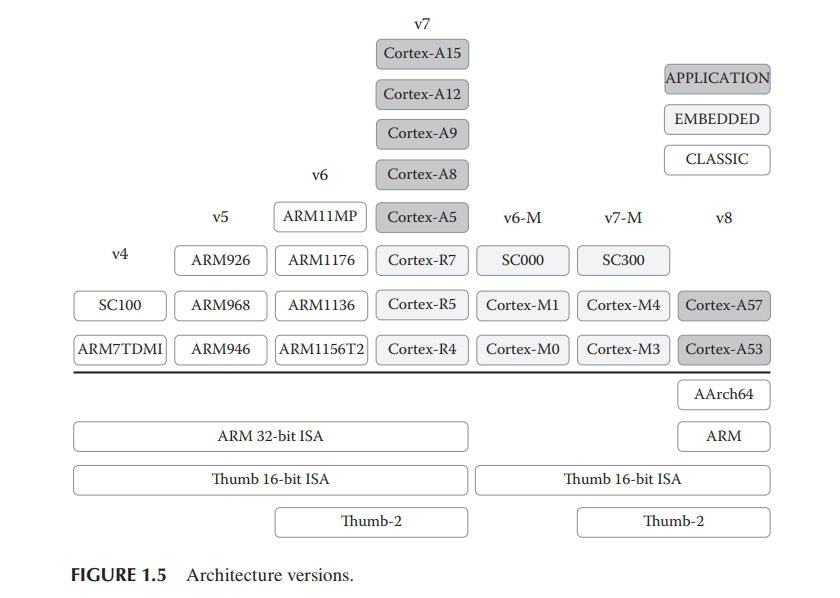
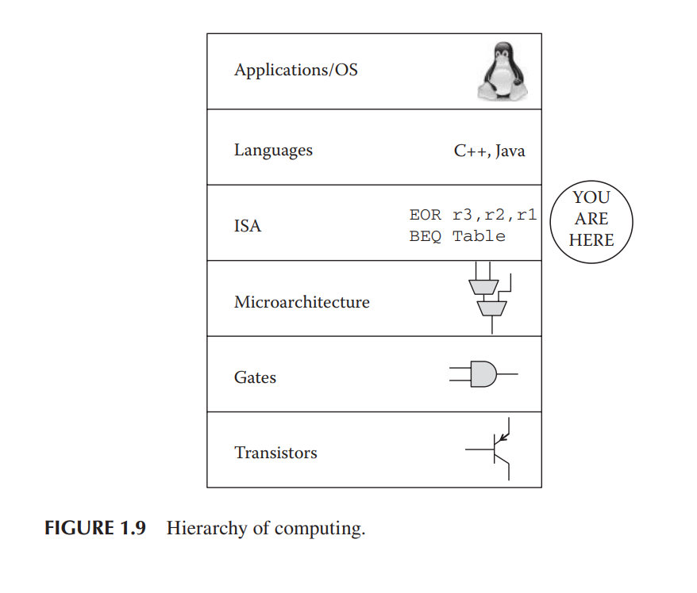

# Chapter 1, An Overview of Computing System
Basically this chapter covers the history of ARM processor and it's respective families, the important milestones and changes throughout the history. Since I'm fairly new to ARM ASM, I'm not going to dwell on history for long.

But I might get back to this when I have the time.

## Why History?
- Older versions:
You might encounter older versions of processors in your career, it's important to learn each versions' changes and quirks, and the general direction of their developments, so you know what you're doing.

## 1.2 History of RISC
- **Reduced Instruction Set Computers (RISC)**:
  - All instructions executed in a **single cycle**.
  - All instructions were the **same size** and had a **fixed format**.
  - Instructions were very simple to decode.
  - The processor contained no microcode.
  - Easier to validate, because the machines are simpler.
  - The processor would access data from external memory with explicit instructions.
    - All other data operations, such as adds, logical operations use only registers on the processor.
    - CISC can tell processor to:
      1. fetch data from memory.
      2. do something with it.
      3. write it back to memory
      4. (done using a single instruction)
      - Convenient for programmers but arduous for processor designers.  
## 1.2.1 ARM

## 1.2.3 ARM Today
To make it easy for silicon partners to design and entire system-on-chip architecture using ARM technology.

## 1.2.4 The Cortex Family
- **Cortex**:
  - For different requirements of embedded systems.
  - Divided with performance(computing), power consumption, response time, processor size.

### Cortex-A
- High-end applications, run Operation-Systems.
  - e.g. smart phones • desktop processors.
- Has significant computational horsepower.
  - For systems containing multiple cores.
- **Specs**:
  - Large Cache, additional arithmetic blocks for graphics and floating point operations.
- **Versions**:
  - 32-bit: A5 • A7 • A8 • A9 • A12 • A15.
  - 64-bit: A57 • A53.

### Cortex-R
- Real-time and/or safety. 
  - e.g. automobile brake system • medical devices
- Often includes redundant systems with more than one processor.
- **Specs**:
  - Large memory systems, wide variety of peripheral and interfaces.
- There are only a handful of commercial offerings right now.

### Cortex-M
- Microcontrollers.
  - small
  - cheap
  - low power consumption
  - small instruction set(56 instructions)
    - can be programmed quickly

## 1.3 The Computing Device

- **ISA**: 
  - Instruction Set Architecture
  - you talk to the processor directly