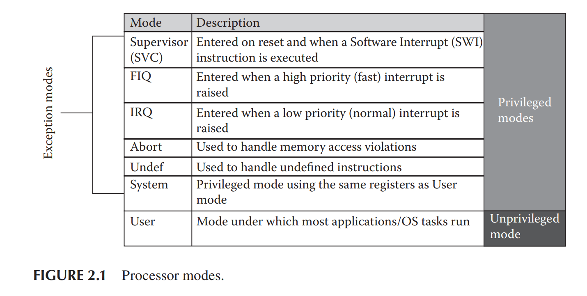
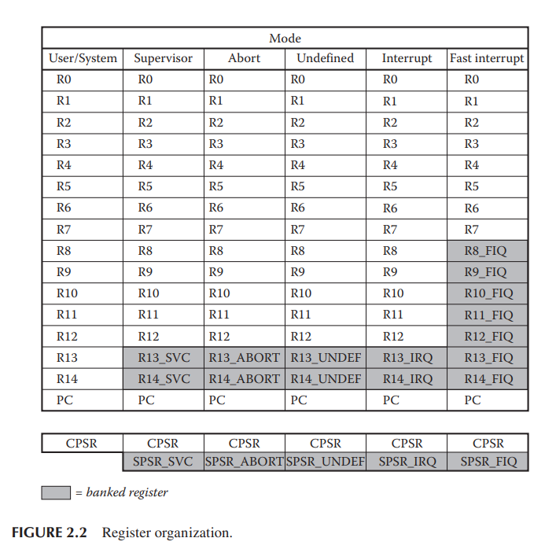

# The Programmer's Model
## 2.1 Introduction
- A programmer...
  - NOT need an understanding of how the processor is constructed.
  - DO need a model of the device.
    - how the processor is controlled
    - the features available
      - E.g. where data is stored • what happens when an exception occurs • where you registers are stacked during an exception
- Begin with **ARM7TDMI** & **Cortex-M4**

## 2.2 Data Types
Data types ARM7TDMI & Cortex-M4 processors supports:
|Types|size|
|---|---|
|Byte|8 bits|
|Halfword|16 bits|
|Word|32 bits|

- **ARM7TDMI**
  - when reading or writing data:
    - halfwords must be aligned to two-byte(16 bits) boundaries.
    - words must be aligned to four-byte(32 bits) boundaries.
- **Cortex-M4**
  - allows unaligned accesses under certain conditions.

## 2.3 ARM7TDMI
- This chapter...
  - points out features that are common to all ARM processors, but differ by number, use, and limitations.
  - ARM7TDMI is a classic ARM core, released wayyy earlier than the Cortex family.

### Processor modes
- Normally:
  - in User or Supervisor mode.
- When external event happens: *interrupts*
  - switch to FIQ or IRQ

- **FIQ**: fast
  - E.g. the machine is about to shutdown in a few seconds
- **IRQ**: slow
  - peripheral needs
    - E.g. user inputs • a key has been pressed
- **Abort**: recover from exceptional conditions
  - E.g. trying to access address that doesn't physically exists.
  - This mode can support virtual memory systems. Often a requirement for Linux systems.
- **Undefined**: when it sees an instruction in the pipeline it doesn't recognize.
  - "historically" can be used to support valid floating-point instructions on machines without physical floating-point hardware.
    - modern systems rarely rely on Undefined mode for such support. 

### Registers (ARM7TDMI)
- **37 registers**: (36+1)
  - 30 general-purpose registers (32 bits) (15+15 banked register)
  - 6 status registers (1 CPSR+5 SPSR)
  - A Program Counter register (PC or r15)
- **banked registers**:
  - processor suddenly changes mode 
  - save the state of the machine
  - swaps certain registers -> access fresh registers.
  - 
- **Program Counter**: pipeline
  - tba
- **Saved Program Status Register**:
  - a banked register
  - each privileged mode has a SPSR
  - preserve the value of CPSR when exception occurs.
  - In User or System mode(unprivileged mode)
    - If you try to read SPSR, you'll get an unpredictable value.
    - If you try write to SPSR, the data will be ignored.
- **Current Program Status Registers**: ([CPSR](/ARM-ASM/CPSR.md))
  - **Condition code flags** (Arithmetic Logic Unit)
    - 31: **N** negative
    - 30: **Z** zero
    - 29: **C** carry (unsigned overflow)
    - 28: **V** (signed) overflow
  - **Control bits**
    - 7: **I** IRQ disable
    - 6: **F** FIQ disable
      - interrupt disable bits (7&6), disable interrupts in the processor if they are set.
    - 5: **T** Status bit
      - indicate the state of the machine(= readonly)
      - bit value 1 = Thumb code(16-bit instruction), 0 = ARM code.
    - 4~0: **M** Mode bits
      - determine the mode in which the processor operates
      - if any value not listed here is programmed into the mode bits, the result is unpredictable.
  - 

> "unpredictable" by ARM's definition:
> 
>The files do not contain valid data, and a value may vary from moment to moment, instruction to instruction, and implementation to implementation.
## 2.4 Cortex-M4

### Processor modes
### Registers (Cortex-M4)