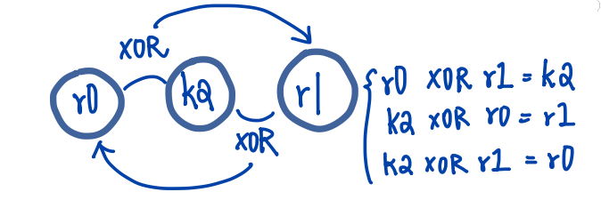

# Chapter 3 Introduction to Instruction Sets, v4T and v7-M
> This chapter is meant to provide a gentle introduction concepts behind, and rules for writing.

## 3.2 ARM, Thumb, and Thumb-2 Instructions
- ARM instructions
  - 32 bits wide
  - first to be used on older architectures
    - E.g  ARM7TDMI • ARM9 • ARM10 • ARM11
- Thumb instructions
  - 16 bits wide
  - a subset of ARM instructions
  - also work on 32-bit data

- Adding two 32-bit numbers together can be done in two ways:
    ```
    ARM instruction:    ADD    r0, r0, r2
    Thumb instruction:  ADD    r0, r2
    ```

## 3.3 Program 1: Shifting Data
> The following examples are using the ARM7TDMI(if not specified) & Keil directives.
- The general format for most of the instructions:
  - `instruction    destination, source, source`

```
        AREA Prog1, CODE, READONLY
        ENTRY

        MOV     r0, #0x11    ; load initial value
        LSL     r1, r0, #1   ; shift 1 bit left
        LSL     r2, r1, #1   ; shift 1 bit left

stop    B       stop         ; stop program
        END
```
- **How the code works**:
  1. load value into r0 using MOV.
  2. shift the value in r0 to the left by 1 bit, then store it into r1, using LSL.
  3. shift the value in r1 to the left by 1 but, then store it into r2, using LSL.

- **MOV**
  - copies one value in a register and paste it to another.
  - normally used to shuffle data from one register to another.
  - NOT used to load data from external memory into a register.
- **stop B stop**
  - the last instruction tells the processor to branch to the branch instruction itself -> infinite loop
- **Instruction address**
  - Program Counter (PC) points to the address of the instruction being fetched.
  - NOTE: the addresses cascades depends on the ISA size (16/32 bits)
    - E.g 0x0004 -> 0x0008 -> 0x000C -> 0x0010

## 3.4 Program 2: Factorial Calculation (n!)
- This section introduces:
  - **Conditional execution**:
    - certain instruction may or may not be performed, depending on the result of another instruction.
  - **Setting flags**:
    - the CMP instruction tells the processor to update the flags in the **Current Program Status Register**.
  - **Change-of-flow instructions**:
    - a branch will load a new address(called a branch target) into the **Program Counter**, and execution will resume from this new address.

```
        AREA Prog2, CODE, READONLY
        ENTRY
        MOV     r6, #10     ; load n into r6
        MOV     r7, #1      ; if n=0, at least n!=1
loop    CMP     r6, #0
        MULGT   r7, r6, r7  
        SUBGT   r6, r6, #1  ; decrement n
        BGT     loop        ; do another mul if counter!= 0
stop    B       stop        ; stop program
        END
```

- **How the code works**:
  1. load values using MOV instructions.
  2. set conditional code flags using CMP.
  3. use conditional suffix `GT` to conditionally perform the instruction `MUL`, `SUB`, and `B`.
  4. if the r6 is greater than 0, the `BGT` will be performed and branch to "loop", thus creating a finite loop.

- **CMP**
  - set the [condition code flags](/ARM-ASM/02-Programmer's-Model.md/###Registers(ARM7TDMI)) from: r6(destination) - zero(source, #0)
  - once the flags are set or cleared by CMP, they stay that way until something else modify them.
  - Instructions with `S` suffix update the flags(base on the results).
    - E.g. `ADDS`
- [CPSR](/ARM-ASM/CPSR.md): For one signed value to be **greater than** another
  - in this case from the CMP instruction: r6-#0
  - Z(zero) flag = 0
  - N(negative/ less than) = V(overflow)
- **Condition suffix**:
  - GT: greater-than
  - GE: greater-than-or-equal
  - LT: less-than
  - EQ: equal
  - NE: not-equal
    - E.g BGT • SUBGT • MULGT

### Similar Code in Cortex-M4 (Thumb-2)
> NOTE: [Cortex-M](/ARM-ASM/01-Overview.md/###CORTEX-M) series is cheap and small.
```
      MOV   r6, #10     ; load 10 into r6
      MOV   r7, #1      ; if n=0, at least n!=0
loop  CMP   r6, #0
      ITTT  GT          ; start of our IF-THEN block
      MULGT r7, r6, r7  
      SUBGT r6, r6, #1  
      BGT   loop        ; end of IF-THEN block
stop  B     stop        ; stop program
```
- Why "IF-THEN":
  - Not have the 4-bit conditional field
    - It just have too few bits to include one
  - so Thumb-2 provides an IF-THEN structure to build small loop effectively

## 3.5 Program 3: Swapping Register Contents
- This section introduces:
  - A fast way to swap two registers without using an intermediate storage location.
    - use the exclusive OR operator.
- algorithm: (storing the result to the LHS of equation)
```
A = A ⊕ B
B = A ⊕ B
A = A ⊕ B
```

> This is similar to how a three-drives backup works, two drives for normal files and one for the first two's XOR result.
> 
> If one of the drives breaks, the other two can "XOR" the broken one back.
```
(A ⊕ B) ⊕ A = B
(A ⊕ B) ⊕ B = A
```

```
        AREA Prog3, CODE, READONLY
        ENTRY
        LDR   r0, =0x1234ABCD   ; load some data
        LDR   r1, =0xAAAAAAAA   ; load some data
        EOR   r0, r0, r1
        EOR   r1, r0, r1
        EOR   r0, r0, r1
stop    B   stop
        END
```

- **LDR**
  - "LDR r0, =0xABCD" is not a legal instruction.
    - it's a **pseudo-instruction**
    - not supported by all tools.
  - this instruction is normally used to bring data from memory into a register. [chapter 5 has more insights on LDR :>](/ARM-ASM/05-Loads-Stores-Addressing.md)

## 3.6 Program 4: Playing with Floating-Point Numbers
- Cortex-M4 is the first Cortex-M processor to offer optional floating-point unit.

### Cortex-M4 code
```
      LDR       r0, =0xE000ED88     ; Read-modify-write
      LDR       r1, [r0]
      ORR       r1, r1, #(0xF << 20) ; Enable CP10, CP11
      STR       r1, [r0]
      VMOV.F    s0, #0x3F800000     ; single-precision 1.0
      VMOV.F    s1, s0
      VADD.F    s2, s1, s0          ; 1.0+1.0=
```

- **How the code works**:
  1. load value into r0 using LDR.
  2. load value(its content) from address 0xE000ED88(stored in r0) to r1.
  3. set the bits r1[23:20] to 1 using ORR(logical OR).
  4. store the value in r1 to the address 0xE000ED88(stored in r0).
  5. load value 0x3F800000("base 10: 1.0" floating-point number) to s0 using `VMOV.F`
  6. **copy** the value from s0 to s1
  7. add the value from s0 and s1 and store it to s2.

- **ORR**
  - logical OR
  - #(0xF << 20) = 0xF shift left x 20 
- **0xE000ED88**:
  - the address of the **Coprocessor Access Control Register**
    - one of the memory-mapped registers used for controlling the floating-point unit.
- **0x3F800000**:
  - (can be) decimal value "1.0" presented as a single-precision floating-point number

## 3.7 Program 5: Moving Values Between Integer And Floating-Point Registers
- This section introduces:
  - how data is transferred between the ARM integer processor and the floating-point unit(FPU). 

### Cortex-M4 code
```
LDR     r0, =0xE000ED88       ; Read-modify-write
LDR     r1, [r0]
ORR     r1, r1, #(0xF << 20)  ; Enable CP10, CP11
STR     r1, [r0]

LDR     r3, =0x3F800000       ; single precision 1.0
VMOV.F  s3, r3                ; transfer contents from ARM to FPU
VLDR.F  s4, =6.0221415e23     ; Avogadro's constant
VMOV.F  r4, s4                ; transfer contents from FPU to ARM
```
- **How the code works**:
  1. the first four instructions are the same as in Program 4: to enable the floating-point unit.
  2. load the representation of 1.0 in single-precision into r3
  3. copy the value in r3 into s3, transferring the value from a integer register to a floating-point register
  4. load s4 with Avogadro's constant
  5. copy the value in s4 into r4, transferring the value from a floating-point register to a integer register.

- Avogadro's constant
  - single-precision number 0x66FF0C30