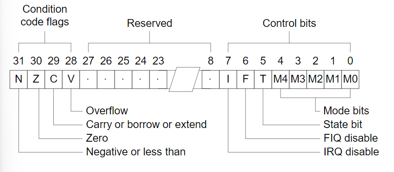

# Current Program Status Register
> ~~who knows it's a bool flag freak like I am HEHEHEH.~~
> Apparently flags have a lot more to cover, so consider this an appendix to [chapter2, register](/ARM-ASM/02-Programmer's-Model.md/#registers-arm7tdmi)



- reference: [Condition Codes 1: Condition Flags and Codes](https://community.arm.com/arm-community-blogs/b/architectures-and-processors-blog/posts/condition-codes-1-condition-flags-and-codes)
## N
Negative, is set by an instruction if the result is negative. In practice, N is set to the two's complement sign bit of the result(bit 31).

## Z
Zero, is set of the result of the flag-setting instruction is zero.

## C
Carry(unsigned overflow), is set if the result of an **unsigned** operation overflows the 32-bit result register. This bit can be used to implement 64-bit unsigned arithmetic.

It operates 4-bits at a time, which means it only counts the "carry" in base 16
```
LDR     r0,=0xFFFFFFFF
ADDS    r1, r0, #1
```
you get `N: 0, Z: 1, C: 1, V: 0`, now we know the result it evaluate is r1, and r1=0XFFFFFFFF+0x00000001=0

## V
Overflow(signed overflow), it works the same as the C flag, but for signed operations.

```
LDR     r0,=0x7FFFFFFF
ADDS    r1, r0, #1
```
0x7FFFFFFF is the largest positive two's complement integer, if you add it by 1, it yields 0x80000000, which is the smallest negative two's complement integer(-2^31).
you get `N: 1, Z: 0, C: 0, V: 1`