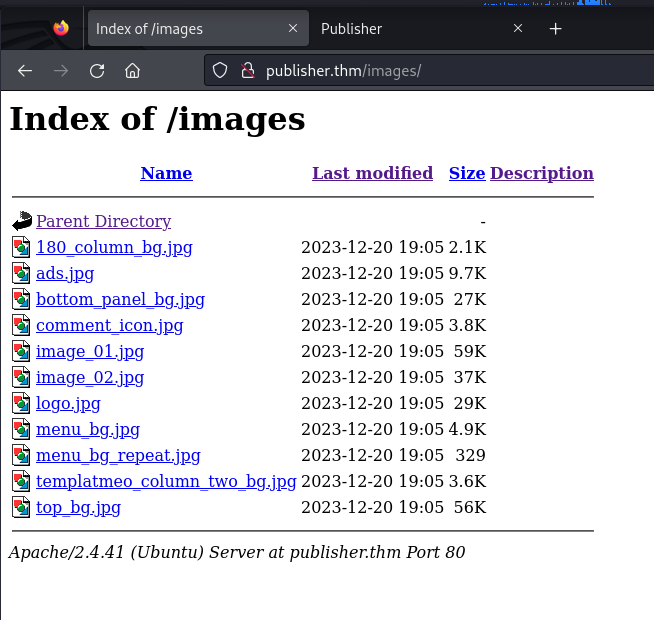

# TryHackMe Publisher

I'm so bad at CTF.

# Info gathering

First see what service is up with `nmap`
```
$ nmap -sC -sV publisher.thm -oA ./nmap/thm/publisher

Starting Nmap 7.94SVN ( https://nmap.org ) at 2024-07-03 12:51 EDT
Nmap scan report for publisher.thm (10.10.80.166)
Host is up (0.39s latency).
Not shown: 998 closed tcp ports (conn-refused)
PORT   STATE SERVICE VERSION
22/tcp open  ssh     OpenSSH 8.2p1 Ubuntu 4ubuntu0.10 (Ubuntu Linux; protocol 2.0)
| ssh-hostkey: 
|   3072 44:5f:26:67:4b:4a:91:9b:59:7a:95:59:c8:4c:2e:04 (RSA)
|   256 0a:4b:b9:b1:77:d2:48:79:fc:2f:8a:3d:64:3a:ad:94 (ECDSA)
|_  256 d3:3b:97:ea:54:bc:41:4d:03:39:f6:8f:ad:b6:a0:fb (ED25519)
80/tcp open  http    Apache httpd 2.4.41 ((Ubuntu))
|_http-title: Publisher's Pulse: SPIP Insights & Tips
|_http-server-header: Apache/2.4.41 (Ubuntu)
Service Info: OS: Linux; CPE: cpe:/o:linux:linux_kernel

Service detection performed. Please report any incorrect results at https://nmap.org/submit/ .
Nmap done: 1 IP address (1 host up) scanned in 49.62 seconds
```

Attacking port 22 where the ssh service is hosted is typically not the next clue when doing a CTF box.

This left us with the option of port 80, where HTTP service is hosted.

**NOTE**:
> I just recently knew that an arbitrary domain name can be dubbed to an IP in `/etc/hosts`. This is important because when doing a CTF box, subdomain enumeration requires a domain to begin with.
>
> Considering you were given an private IP address in a LAN, there's no dns to resolve your IP.

The website: `http://publisher.thm`


The links except "related blogs" which are out of scope (outside webpages), are all anchors and doesn't lead anywhere.

The method left is to FUZZ

# Enumeration/ Scanning

First let's see if there's any interesting subdomains
```
$ ffuf -w /usr/share/dirb/wordlists/big.txt -u "http://publisher.thm" -H "HOST: FUZZ.publisher.thm" -fs 8686
```

The answer is no, it didn't give me any subdomain.

**NOTE**
> `-fs 8686` was added after it gave me repetitive useless results (ones that gives an error)


Let's try directory discovering:
```
$ ffuf -w /usr/share/dirb/wordlists/big.txt -u "http://publisher.thm/FUZZ"

        /'___\  /'___\           /'___\       
       /\ \__/ /\ \__/  __  __  /\ \__/       
       \ \ ,__\\ \ ,__\/\ \/\ \ \ \ ,__\      
        \ \ \_/ \ \ \_/\ \ \_\ \ \ \ \_/      
         \ \_\   \ \_\  \ \____/  \ \_\       
          \/_/    \/_/   \/___/    \/_/       

       v2.1.0-dev
________________________________________________

 :: Method           : GET
 :: URL              : http://publisher.thm/FUZZ
 :: Wordlist         : FUZZ: /usr/share/dirb/wordlists/big.txt
 :: Follow redirects : false
 :: Calibration      : false
 :: Timeout          : 10
 :: Threads          : 40
 :: Matcher          : Response status: 200-299,301,302,307,401,403,405,500
________________________________________________

.htpasswd     [Status: 403, Size: 278, Words: 20, Lines: 10, Duration: 396ms]
.htaccess     [Status: 403, Size: 278, Words: 20, Lines: 10, Duration: 1991ms]
images        [Status: 301, Size: 315, Words: 20, Lines: 10, Duration: 397ms]
server-status [Status: 403, Size: 278, Words: 20, Lines: 10, Duration: 393ms]
spip          [Status: 301, Size: 313, Words: 20, Lines: 10, Duration: 398ms]
```

Seems like it gave us some interesting directories.

---

`.htpasswd` `.htaccess` `server-status` looks like this:


`images` looks like this:


---
I'm thinking it could be vulnerable to code injection

https://www.imperva.com/learn/application-security/command-injection/

Okay after some digging around 
- `http://publisher.thm/images` is probably not vulnerable.
  - it has a function to sort the entry by name, but I don't think there's a function that could be exploited. (still needs to be checked though)
- `http://publisher.thm/spip` has some interesting php innit
  - and it also has a **login page** that could be vulnerable to injection

> I've done 1 or 2 guided CTF box that is vulnerable to injection, how am I still suck at this.

---

Yes it's vulnerable to code injection

https://github.com/0SPwn/CVE-2023-27372-PoC

The server is hosting an outdated spip application on version 4.2.0

**next time do a version check for the application before banging your head at the wall repeatedly**

okay I got stuck for too long and decided to read a write up

https://medium.com/@josemlwdf/publisher-cccb172abd8e


I should try this box later to see if I remember anything