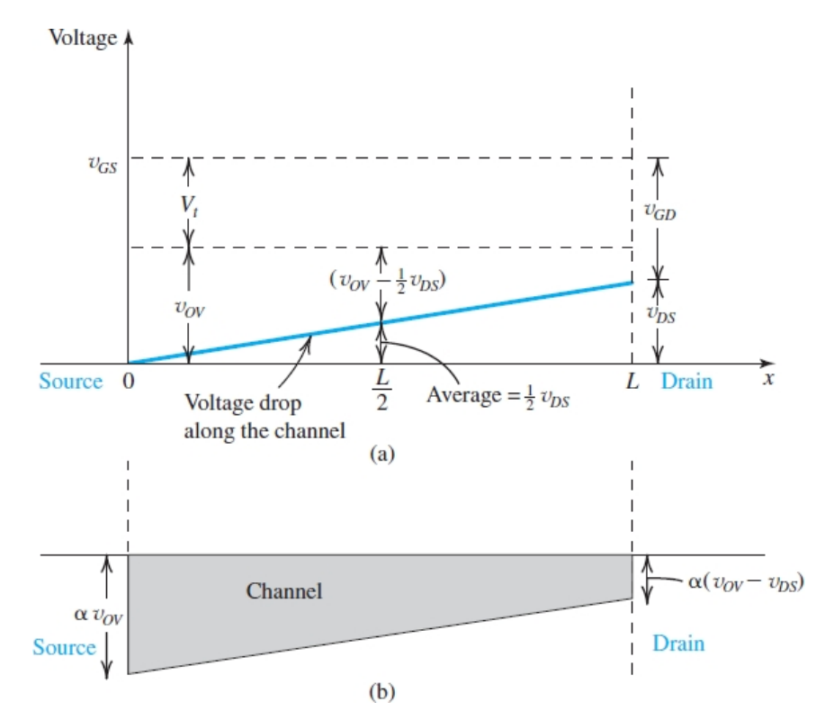
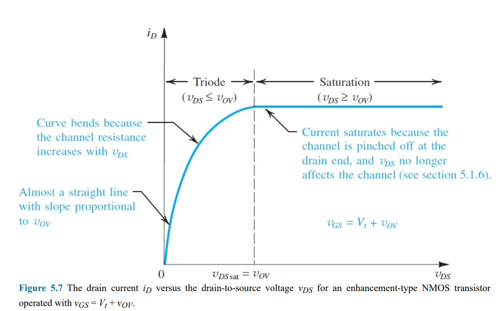
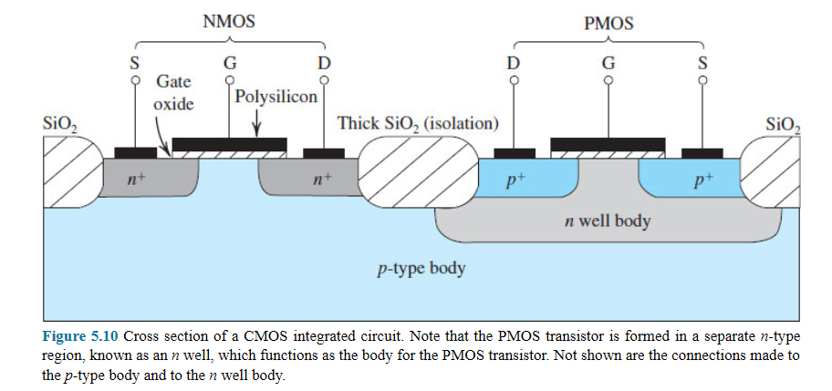
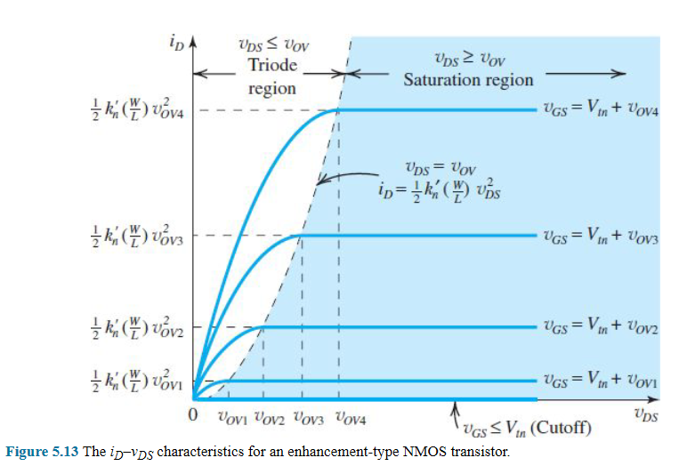
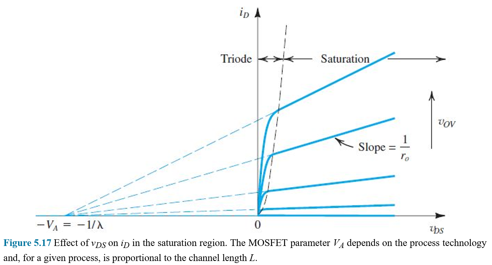

# Chapter 5, MOSFET
> Metal-oxide-semiconductor field-effect transistor.

> I made this more "concept oriented" and try to explain how it happens or where it comes from. This maybe a one man note but it is, in fact, notes.

- [Chapter 5, MOSFET](#chapter-5-mosfet)
- [Keys](#keys)
- [Summary](#summary)
- [5.1 Device Structure and Physical Operation](#51-device-structure-and-physical-operation)
  - [5.1.1 Device Structure](#511-device-structure)
  - [5.1.2 Operation with Zero Gate Voltage](#512-operation-with-zero-gate-voltage)
  - [5.1.3 Creating a Channel for Current Flow](#513-creating-a-channel-for-current-flow)
  - [5.1.4 Applying a Small vDS](#514-applying-a-small-vds)
  - [5.1.5 Operation as vDS is Increased](#515-operation-as-vds-is-increased)
  - [5.1.6 Operation for vDS ≥ vOV: Channel Pinch-Off and Current Saturation](#516-operation-for-vds--vov-channel-pinch-off-and-current-saturation)
  - [5.1.7 The p-Channel MOSFET](#517-the-p-channel-mosfet)
  - [5.1.8 Complementary MOS or CMOS](#518-complementary-mos-or-cmos)
- [5.2 Current-Voltage Characteristics](#52-current-voltage-characteristics)
  - [5.2.1 Circuit Symbol](#521-circuit-symbol)
  - [5.2.2 The iD-vDS Characteristics](#522-the-id-vds-characteristics)
    - [5.2.2s Triode Region](#522s-triode-region)
    - [5.2.2s Saturation Region](#522s-saturation-region)
    - [5.2.2s Graph](#522s-graph)
  - [5.2.3 The iD-vGS Characteristic](#523-the-id-vgs-characteristic)
  - [5.2.4 Finite Output Resistance in Saturation](#524-finite-output-resistance-in-saturation)
  - [5.2.5 Characteristics of the p-channel MOSFET](#525-characteristics-of-the-p-channel-mosfet)
- [5.4 Technology Scaling (Moore's Law) and Other Topics](#54-technology-scaling-moores-law-and-other-topics)

# Keys
eh why not
- 5.1 Device Structure and Physical Operation
  - 5.1.1 Device Structure
  - 5.1.2 Operation with Zero Gate Voltage
  - 5.1.3 Creating a Channel for Current Flow
  - 5.1.4 Applying a Small vDS
  - 5.1.5 Operation as vDS is Increased
  - 5.1.6 Operation for vDS ≥ vOV: Channel Pinch-Off and Current Saturation
  - 5.1.7 The p-Channel MOSFET
  - 5.1.8 Complementary MOS or CMOS
- 5.2 Current-Voltage Characteristics
  - 5.2.1 Circuit Symbol
  - 5.2.2 the iD-vDS Characteristics
  - 5.2.3 The iD-vGS Characteristics
  - 5.2.4 Finite Output Resistance in Saturation
  - 5.2.5 Characteristics of the p-Channel MOSFET
- 5.3 MOSFET Circuits at DC
- 5.4 Technology Scaling (Moore's Law) and Other Topics
  - 5.4.1 Technology Scaling
  - 5.4.2 Subthreshold Conduction and Leakage Currents
  - 5.4.3 The Role of the Substrate- The Body Effect
  - 5.4.4 Temperature Effects
  - 5.4.5 Breakdown and Input Protection
  - 5.4.6 The Depletion-Type MOSFET

# Summary
5.1 SUMMARY:

We now know how to activate a transistor (vGS ≥ Vt, vOV=vGS-Vt), how many charges are in the transistor's channel (|Q|=Cox(WL)vOV), and how fast the charges goes when applying voltage at the drain channel (iD=kn⋅vOV⋅vDS). 
 
With the drain voltage we analyzed how different magnitudes of vDS affects iD (vDS versus vOV), vDS creates a voltage drop across the drain and source terminals, subsequently affects the effective voltage (aka overdrive voltage, vOV) that give rise to the channel charge, and affects how we write the iD equation (iD=kn⋅(vOV-(0.5vDS))⋅vDS) (5.7).

> Astelor: no one's reading all that

# 5.1 Device Structure and Physical Operation
> Enhancement-type MOSFET is the most widely used FET

## 5.1.1 Device Structure
> MOSFET's physical structure. (not practical structure)

Physical structure of n-channel enhancement-type MOSFET:
```
        +-----------+
        |Gate(metal)|
   +--+ +-----------+ +--+
   |S | |oxide(SiO2)| |D |
+-+------+---------+------+-+
| | n+   | Channel | n+   | |
| +------+ region  +------+ |
| p-type substrate          |
+---------------------------+
          | Body |
          +------+
```
- Terminals: a layer of metal, creating an electrode
  - S: Source → connecting the n+
  - G: Gate → insulated from body
  - D: Drain → connecting the n+
  - B: Body → connecting the substrate
- n+: n-type semiconductor (source & drain region)
- p-type substrate: single-crystal silicon wafer
- oxide: electrical insulator

---

- Alias:
  - aka NMOS transistor
  - aka n-channel MOSFET.
- (theoretically) MOSFET is symmetrical, interchanging S and D makes no difference.
  - Physical structure in practice is not symmetrical

Specifications (that matters):
```
        +-----------+
        |           |
   +--+ +-----------+ +--+
   |  | |↕tOX       | |  |
+-+------+---------+------+-+
| |      |         |      | |
| +------+ <-L---> +------+ | W
|            Length         | Width
+---------------------------+
          |      |
          +------+
```

## 5.1.2 Operation with Zero Gate Voltage
> Equivalent to two back-to-back diodes in series when vGS=0,

The path between D and S has a very high resistance (of the order of 10^12 Ω)

## 5.1.3 Creating a Channel for Current Flow
> Apply positive gate voltage to attract charges, creating a (large enough) canal. vGS ≥ Vtn.

Creating the "channel" (a canal for current):
- **Gate terminal positively charged**: (and caused the following effect)
  - push free holes in the substrate down → uncovers bound negative charge (creates depletion region)
  - attracts electrons from n+ regions to the channel region (underneath the oxide plate, still in the substrate)
- Sufficient electrons in the "channel" → the channel connects S and D terminals.

> In short, Gate positive voltage → attract electrons → n-channel.

The gate voltage(+) and channel(-) create an parallel-plate capacitor:
```
+----------------+
| Gate plate (+) |
+----------------+
| the oxide      | ↓ Electric
+----------------+   field ∝ vOV
| n-channel (-)  |
+----------------+
```
- the oxide: capacitor dielectric
- electric field: controls the amount of charges in the channel
  - → hence the name field-effect transistor

`!(5.1)`
$$v_{GS}-V_t≡v_{OV}$$

Activation of the transistor:
- Vt: threshold voltage
  - **The minimum voltage required between the Gate and the Source to turn the transistor on.**
  - A fixed value
  - Is positive for NMOS
  - Typically 0.3V~1.0V
- **vOV**: effective voltage or overdrive voltage
  - The excess of vGS over Vt
  - Also the average voltage that gives rise to channel charge (when it's not affected by the drain voltage)
- vGS: voltage applied to the gate

> The gate voltage must exceed the threshold voltage to create an effective voltage between the parallel plate capacitor, so that it holds charges for the channel.

`(5.2)`
$$|Q|=[C_{ox}(WL)]v_{OV}$$

Magnitude of the electron charge in the channel:
- |Q|: yes
- Cox: oxide capacitance **(F/m^2)**
  - capacitance of the parallel-plate capacitor per unit gate area
- W: width of the channel (in the substrate)
  - can be as WIDE as you want (?)
- **L**: length of the channel (between the n+ regions)

> because the channel itself is one side of a capacitor

`!(5.3)`
$$C_{ox}=\frac{ϵ_{ox}}{t_{ox}}$$

Getting Cox from the specifications:
- ϵox: permittivity of the silicon dioxide
  - 3.9ϵ0 = 3.9 x 8.854 x 10^(-12) = 3.45 x 10^(-11) (F/m)
- **tox**: the thickness of the oxide

> How many charges the channel can hold is decided by its capacitance, which is a fixed value decided by its physical properties (dielectric material, thickness, plate surface area)

## 5.1.4 Applying a Small vDS
> Applying positive drain voltage (vDS) to make the electrons in the channel move. (vDS ≪ vOV. in "Triode Region")

**NMOS** terminal names:
- Source terminal: **the source of free electrons**
- Drain terminal: the drain of free electrons
- current: S→D, carried by free electrons

```
            (vGS>0)
(ground)    [G]       (vDS>0)
     [S]     |↓iG=0   [D]
iS=iD↑| =============  |↓ iD
   ==== ============= ====
+-+------+---------+------+-+
| |  n+  |   ←iD   |  n+  | |
| +------+ <--L--> +------+ | 
|  p-type substrate         | 
+---------------------------+
          ======
             |
            [B] (ground)         
```

So how fast does the electrons go?
> Calculation of Ampere here (Ampere = Coulomb/second)

`(5.4)`
$$\frac{|Q|}{L}=C_{ox}Wv_{ox}$$

Charge per unit channel length (C/m) → the amount of charge in a cross-sectional area.

`(5.5)`
$$|E|=\frac{v_{DS}}{L}$$

Electric field established by vDS across the length of the channel (V/m).

`!(5.6)`
$$Electron\ drift\ velocity=μ_n|E|=μ_n\frac{v_{DS}}{L}$$

- μn: mobility of the electrons (at the surface of the channel)

`!(5.7)`

with (5.4) (5.6) we get (C/m)*(m/s) = (C/s) = (Ampere)
$$i_D=[ (μ_nC_{ox})(\frac WL) ]v_{OV} v_{DS}$$

> Ampere is the rate at which the charges go through a cross-sectional area, you have (5.4) dictates how many charges are in a two dimensional area, and (5.6) dictates how "long" the charges passes for an unit second, creating a three dimensional volume, so you have how exactly many charges that have passed through the said area in a second. Which is, Ampere!

`(5.8)`

and we can substitute vOV with (vGS - Vt) Eq.(5.1)
$$i_D=[ (μ_nC_{ox})(\frac WL) ](v_{GS} - V_t) v_{DS}$$

`(5.9)`

dividing the current by its voltage, we get the conductance as well!
$$g_{DS}=[ (μ_nC_{ox})(\frac WL) ]v_{OV}=\frac{i_D}{v_{DS}}$$

- The conductance is determined by three factors
  - $μ_nC_{ox}$, process transconductance
  - $\frac WL$, aspect ratio
  - $v_{OV}$, overdrive voltage

`(5.10)` or (substitute vOV with vGS - Vt Eq.(5.1))

---
Explanation of the three factors from Eq. (5.9)

`(5.11)` 

factor 1 from (5.9)
$$k_n'=μ_nC_{ox}$$

The process transconductance **(A/V^2)**, where n denotes n channel.

`!(5.12)`

factor 1+2 from (5.9)
$$k_n=k_n'(\frac WL)=(μ_nC_{ox})(\frac WL)$$

the MOSFET transconductance parameter (A/V^2) 
And we can see this parameter is a constant.
- **(W/L)**: aspect ratio → dimensionless
  - The length has a minimum value, and is limited to our manufacture technology.

> vOV, the one value that rules them all. It directly determines the magnitude of electron charge in the channel. And is in fact, determined by vGS, the gate voltage.

---

`(5.13a)`

the reciprocal of conductance is resistance
$$r_{DS}=\frac{1}{g_{DS}}=\frac{v_{DS}}{i_D}$$


`(5.13b)` 

you can replace gDS with its own definition (5.9), and substitute vOV to vDS - Vt (5.1)

$$r_{DS}=\frac{1}{(μ_nC_{ox})(W/L)(v_{GS}-V_t)}$$

Note:
$$r_{DS}=∞,\ when\ vGS ≤ Vt$$

> When the gate voltage is lower than the threshold voltage, it doesn't conduct (not enough charge, no channel, no current). When the gate voltage is larger, more charges will gather, it's a capacitor ok.

- Enhancement-mode operation & enhancement-type MOSFET
  - resistance decreases as vGS is increased above Vt
  - → **enhancing** the channel
  - thus the names

> Astelor: I still don't understand what figure 5.4 is about

## 5.1.5 Operation as vDS is Increased
> Increase the applied drain voltage (vDS), vDS affects vOV, so the current change corresponding to the drain voltage change is NOT linear. (vDS ≤ vOV, average voltage: vOV - (1/2) vDS. "Triode Region".) 

```
            (vGS>0)
(ground)    [G]       (vDS>0)
     [S]     |↓iG=0   [D]
iS=iD↑| =============  |↓ iD
   ==== ============= ====
+-+------+---------+------+-+
| |  n+  |   ←iD   |  n+  | |
| +------+ <--L--> +------+ | 
|  p-type substrate         | 
+---------------------------+
          ======
             |
            [B] (ground)    
```



$$v_{GD}+v_{DS}=v_{GS}=V_t+v_{OV}$$

$$v_{GD}=v_{GS}-v_{DS}=V_t+v_{OV}-v_{DS}$$


- Effect on average voltage
  - vGS remains constant
  - → vOV remains constant (vOV=vGS-Vt)
  - The applied vDS is a voltage drop from the drain end to the source end (vS=0V).
  - → the shallowest end at the drain has the depth proportional to vOV - vDS

`!(5.14)`

Taking the "tapered channel" into consideration, while vDS < vOV
$$i_D=k_n'(\frac WL)(v_{OV}-\frac{1}{2}v_{DS})v_{DS}$$

Average voltage used (the one that affects channel charge):
- vDS !≪ vOV (voltage drop created by vDS is NOT negligible)
  - vOV - (1/2) vDS
- vDS ≪ vOV (voltage drop is negligible)
  - vOV

`(5.15)`

Writing (5.14) in an alternate form
$$i_D=k_n'(\frac WL)(v_{OV}v_{DS}-\frac 12v_{DS}^2)$$

`(5.16)` We can also replace vOV with "vGS - Vt" and rewrite (5.15)

Current voltage characteristic:


vOV is a constant here, the graph can be referred to equation (5.15)

## 5.1.6 Operation for vDS ≥ vOV: Channel Pinch-Off and Current Saturation
> We know vDS can affect the average voltage(vOV-(1/2)vDS) that gives rise to the channel charge (5.2), what happens when vDS is LARGE? applying vDS, and vDS ≥ vOV. average voltage is (1/2)(vOV^2)
> "Saturation Region".

> Spoiler: the "tapering effect" stops at vDS = vOV, the channel depth at the drain(vOV - vDS = 0) is pinch-off. When vDS > vOV, (ideally) nothing happens, the drain current saturates at vDS = vOV, and iD remains the same. The excess voltage of vDS will be dropped like your internet packets at school.
>
> **Astelor: no one's reading this!**


please refer to the graph at 5.1.5 for the simplified diagram :)

```
  Voltage
     |
     |----+
 Vt ↕|    | ↕ vGD = Vt
     |----+ pinch-off
   ↑ |   /| ↑
vOV| |  / | | vDS = vOV
   | | /  | |
   ↓ |/   | ↓
     +--------> x
     0    L
```

`(5.17)`

rewriting equation (5.14), when vDS = vOV

$$i_D=\frac 12k_n'(\frac WL)(v_{OV}^2)$$

`(5.18)`

$$v_{DSsat}=v_{OV}=v_{GS}-V_t$$

The voltage vDS at which the saturation occurs is denoted vDSsat

- MOSFET enters saturation region
  - iD remains the same. (5.17)
  - any increase in vDS above vOV appears as a voltage drop across the depletion region. (5.17)
  - the drain end has channel pinch-off, (5.18)

`(5.19)` we can also replace vOV with vGS - Vt and rewrite (5.17)

> look at da graph!
---
> Astelor: you might want a cheat sheet for the equations for quick reviewing.

## 5.1.7 The p-Channel MOSFET
> The reverse of NMOS, PMOS and NMOS are complementary devices

```
        +-----------+
        |Gate(metal)|
   +--+ +-----------+ +--+
   |S | |oxide(SiO2)| |D |
+-+------+---------+------+-+
| | p+   | Channel | p+   | |
| +------+ region  +------+ |
| n-type substrate          |
+---------------------------+
          | Body |
```

Instead of npn, PMOS is pnp, gate voltage is negative, drain voltage is negative, the S → the source of positive carriers, creating a p channel.

```
            (vGS<0)
(ground)    [G]       (vDS<0)
     [S]     |↓iG=0   [D]
iS=iD↓| =============  |↑ iD
   ==== ============= ====
+-+------+---------+------+-+
| |  p+  |    iD→  |  p+  | |
| +------+ <--L--> +------+ | 
|  n-type substrate         | 
+---------------------------+
          ======
             |
            [B] (ground)    
```

$$v_{GS}≤V_{tp}<0$$

$$|v_{SG}|≥|V_{tp}|$$

- Vtp: threshold voltage for PMOS by convention is **negative**

$$k_p'=μ_pC_{ox}$$

$$k_p=k_n'(W/L)$$

- μp: mobility of the holes in the induced p-channel (μp=0.25μn ~ 0.5μn)
  - is process-technology dependent

## 5.1.8 Complementary MOS or CMOS

> NMOS + PMOS = CMOS, most widely used of all the IC technologies in both analog and digital circuits



- more difficult to fabricate
- makes many powerful circuit configuration possible

> how and why CMOS though?

# 5.2 Current-Voltage Characteristics

> Static characteristics → measured at dc or low frequencies

> The dynamic effects will be discussed in chapter 10.

## 5.2.1 Circuit Symbol
> SYMBOL

Circuit symbol for the n-channel enhancement-type MOSFET:
```
       D
       |
    |--+
G--||<---B
    |--+
       |
       S
(a)
```
Modified circuit symbol with an arrowhead on the source terminal to distinguish it from the drain and to indicate device polarity:
```
       D
       |
    |--+
G--||----B
    |->+
       |
       S
(b)
```
Simplified circuit symbol when the source is connected to the body, or when the effect of the body on device operation is unimportant:
```
       D
       |
    |--+
G--||
    |->+
       |
       S
(c)
```

> In practice, the polarity of the voltage applied across the device that determines the source and drain, the drain is always positive relative to the source in a n-channel MOSFET

## 5.2.2 The iD-vDS Characteristics
> The graph about iD-vDS characteristics is shown in [5.1.5](#515-operation-as-vds-is-increased)

> Table 5.1 covers NMOS triode region and saturation region.

- Drain voltage can be used to achieve triode and saturation region
- Gate voltage can be used to achieve the same thing.
  -  → vGS governs the total charge in the channel.

### 5.2.2s Triode Region
- Continuous channel (not pinched-off): $v_{GD}>V_{tn}$
- or equivalently: $v_{DS} < v_{OV}$
- then: $i_D=k_n' (\frac WL) (v_{OV}- \frac 12 v_{DS}) v_{DS}$
- or equivalently: $i_D=k_n'(\frac WL)[(v_{GS}-V_{tn})v_{DS}-\frac 12v_{DS}^2]$

### 5.2.2s Saturation Region
- Pinched-off channel: $v_{GD}≤V_{tn}$
- or equivalently: $v_{DS}≥v_{OV}$
- then: $i_D=\frac 12k_n'(\frac WL)v_{OV}^2$
- or equivalently: $i_D=\frac 12k_n'(\frac WL)(v_{GS}-V_{tn})^2$

### 5.2.2s Graph


- vOV = vGS - Vtn
- → Treating vOV as a constant in each iteration of the functions. 
- The "points" where MOSFET enters saturation region (vDS=vOV) can be described by Eq. (5.20)
  - → The dotted line in the graph below.



`(5.20)`

$$i_D=\frac 12k_n'(\frac WL)v_{DS}^2$$
when vDS=vOV (entering saturation region)

- For each vGS value (incremented by vOV)
- → draw a corresponding iD-vDS plot

## 5.2.3 The iD-vGS Characteristic
> Using MOSFET as an amplifier.
> 
>  vGS as input, vDS as a constant, its operation is in the saturation region (vDS ≥ vOV).

Condition:
- In **saturation** region.
- The drain current (iD) is determined by the gate voltage (vGS=vOV+Vt) 
- → Drain current is independent of drain voltage (vDS).

- → MOSFET operates as a **voltage-controlled current source**

`(5.21)`

$$i_D=\frac 12k_n'(\frac WL)(v_{GS}-V_{tn})^2$$

`(5.22)` or in terms of vOV

$$i_D=\frac 12k_n'(\frac WL)v_{OV}^2$$

Observation:
- MOSFET operates as an **amplifier**.
  - → transconductance amplifier (voltage input, current output)
- Current-voltage characteristic (iD-vGS) is **nonlinear**.
  - → square-law 
  - from (vGS-Vt)^2

Large-signal equivalent circuit:
```
iG=0→       ←iD
G o--o    +----o D
     +vGS |    +vDS
          ▲
          ↓ (1/2)k'n(W/L)(vGS-Vtn)^2
          ▼
     -    |    -
  o----+--+----o
       |
       o S  vGS≥Vtn (not cutoff)
            vDS≥vOV (saturation)
```

## 5.2.4 Finite Output Resistance in Saturation
> In practice, the drain current won't be a constant in saturation. 
> 
> rDS<∞, given vGS, vDS yields corresponding change in iD, in saturation region.

Ideally:  (in saturation)

- iD is independent of vDS
  - → iD is a constant no matter the change in vDS
  - → rDS is infinite (vDS can be VERY big). 
- (vDS has no effect on the channel's shape once vDS≥vOV (pinched-off).)

In practice: (in saturation, vDS≥vOV)

- Pinch-off point moves slightly **away** from the drain
- → **channel-length modulation**.
- → iD **increases linearly** in the saturation region.

Channel-length modulation:

```
S+-------------+------+D
 |◤channel     |      |
 |-        vOV+|-    +| vDS-vOV
 |<---(L-∆L)-->|<-∆L->|
 |<-----L------------>|
```

`(5.23)`

We account for this effect for iD by including a factor 1+λ(vDS-vOV) or **(1+λvDS)**

$$i_D=\frac 12k_n'(\frac WL)(v_{GS}-V_{tn})^2(1+λv_{DS})$$

- λ: device parameter 
  - Unit: reciprocal volts (V^-1)
  - Value: depends on both process technology and channel length L.
  - New technology:
  - → shorter L 
  - → more greatly impacted by channel-length modulation

$$V_A=\frac 1λ$$

- VA: device parameter (V)
  - aka **Early voltage**.
  - $V_A=V_A'L$, proportional to channel length L
- VA': entirely process-technology dependent (V/μm)
  - Typically 5 V/μm ~ 50 V/μm

> After taking channel-length modulation into account, the saturation value of iD depend on vDS. 
> 
> For a given vGS, "a change ∆vDS yields a corresponding change ∆iD in the drain current iD."



`(5.24)`

$$r_o≡[\frac{∂i_D}{∂v_{DS}}]^{-1}_{v_{GS}\ constant}$$

`(5.25)`

using Eq.(5.23):

$$r_o=[λ\frac{k_n'}{2}\frac WL(v_{GS}-V_{tn})^2]^{-1}$$

`(5.26)`

which can be written as:

$$r_o=\frac{1}{λi_D'}$$

`(5.27)` 

or, equivalently:

$$r_o=\frac{V_A}{i_D'}$$

`(5.27')`

$$i_D'=\frac 12k_n'\frac WL(v_{GS}-V_{tn})^2$$

- iD': drain current without channel-length modulation.

Large-signal, equivalent-circuit:

```
iG=0→       ←iD
G o--o    +--+--o D
     +vGS |  |  +vDS
          ▲  |
          ↓ [ro]
          ▼  |
     -    |  |  -
  o----+--+--+--o
       |
       o S  vGS≥Vtn (not cutoff)
            vDS≥vOV (saturation)
```

- The voltage-controlled current source is shunted by a resistor, ro.

## 5.2.5 Characteristics of the p-channel MOSFET

> It's the opposite to NMOS. If you know how FET works, it shouldn't be hard to convert the concepts in NMOS to PMOS.

Terminal:

- Drain: drain of **holes**, instead of electrons
  - Negatively charged
- Source: source of holes, instead of electrons
- Gate: gate to attract holes, a positive channel
  - Negatively charged.

> Terminal polarities are completely reverse

> All the equations are the same.

# 5.4 Technology Scaling (Moore's Law) and Other Topics

> Astelor: I'm not quite sure what I should do with this chapter

