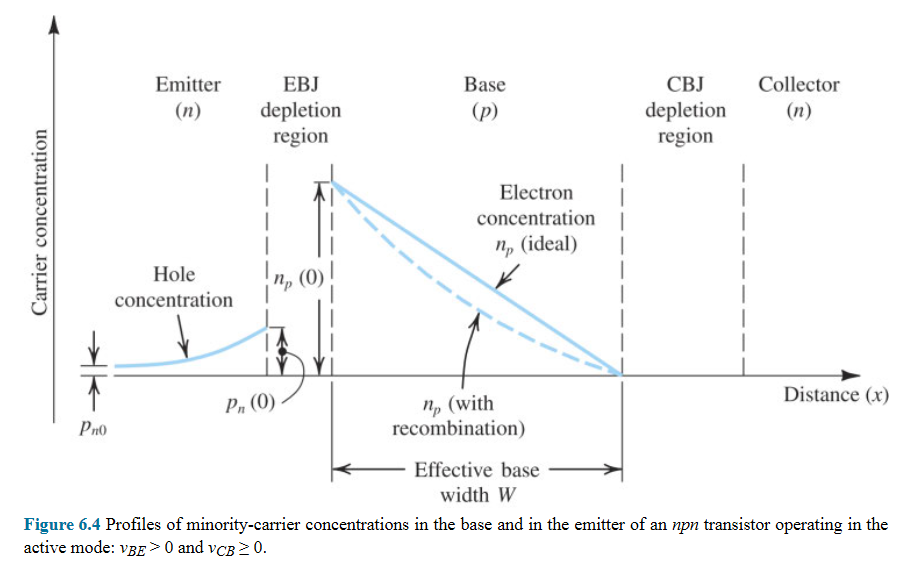

# Chapter 6, Bipolar Junction Transistor

> aka BJT
> 
> a dangling note waiting to be written.
> 
> well well well, isn't it the consequences to my actions.

- [Chapter 6, Bipolar Junction Transistor](#chapter-6-bipolar-junction-transistor)
- [Keys](#keys)
- [6.1 Device Structure and Physical Operation](#61-device-structure-and-physical-operation)
  - [6.1.1 Simplified Structure and Modes of Operation](#611-simplified-structure-and-modes-of-operation)
  - [6.1.2 Operation of the npn Transistor in the Active Mode](#612-operation-of-the-npn-transistor-in-the-active-mode)
    - [6.1.2s Current Flow](#612s-current-flow)
    - [6.1.2s The Collector Current](#612s-the-collector-current)
    - [6.1.2s The Base Current](#612s-the-base-current)
    - [6.1.2s The Emitter Current](#612s-the-emitter-current)
    - [6.1.2s Minority-Carrier Distribution](#612s-minority-carrier-distribution)
    - [6.1.2s Recapitulation and Equivalent-Circuit Models](#612s-recapitulation-and-equivalent-circuit-models)
  - [6.1.3 Structure of Actual Transistors](#613-structure-of-actual-transistors)

# Keys
- 6.1 Device Structure and Physical Operation
  - 6.1.1 Simplified Structure and Modes of Operation
  - 6.1.2 Operation of the npn Transistor in the Active Mode
  - 6.1.3 Structure of Actual Transistors
  - 6.1.4 Operation in the Saturation Mode
  - 6.1.5 The pnp Transistor 
- 6.2 Current-Voltage Characteristic
  - 6.2.1 Circuit Symbols and Conventions
  - 6.2.2 Graphical Representation of Transistor Characteristics
  - 6.2.3 Dependence of iC on the Collector Voltage-The Early Effect
  - 6.2.4 An Alternative Form of the Common-emitter Characteristics
- 6.3 BJT Circuits at DC
- 6.4 Transistor Breakdown and Temperature Effects
  - 6.4.1 Transistor Breakdown
  - 6.4.2 Dependence of beta on iC and Temperature

# 6.1 Device Structure and Physical Operation

## 6.1.1 Simplified Structure and Modes of Operation

> The basics...

Simplified structure of npn transistor: (like NMOS)
```     
      +---------+--------+-----------+
      | n-type  | p-type | n-type    |
 o----+ Emitter | Base   | Collector +----o
(E)   | region  | region | region    |   (C)
      +---------+----+---+-----------+
(emitter-base  EBJ   |  CBJ (collector-base
 junction)           o       junction)
                    (B)
```

Simplified structure of pnp transistor: (like PMOS)
```     
      +---------+--------+-----------+
      | p-type  | n-type | p-type    |
 o----+ Emitter | Base   | Collector +----o
(E)   | region  | region | region    |   (C)
      +---------+----+---+-----------+
                     | 
                     o      
                    (B)
```

- Two pn junctions:
  - emitter-base junction (EBJ)
  - collector-base junction (CBJ)
- Three terminals:
  - emitter (E)
  - base (B)
  - collector (C)

Biasing conditions at junctions give different modes of operations.

> - Current flows from: 
>   - n->p reverse bias
>   - p->n forward bias
> - "negative" -> "positive", reverse. 
> - "positive" -> "negative", forward.

BJT modes of operation:
|Mode|EBJ|CBJ|
|-|-|-|
|Cutoff|Reverse|Reverse|
|Active|Forward|Reverse|
|Saturation|Forward|Forward|

Charge carriers of **both polarities** participate in the current-conduction process in a bipolar transistor. (Contrasting with MOSFET where current is conducted by one type of carrier.)

## 6.1.2 Operation of the npn Transistor in the Active Mode

> go transistor go

- EBJ: forward bias
- CBJ: reverse bias

```   forward-biased    reverse-biased    
      +---------+--------+-----------+
(E)   |    n    |    p   |     n     |   (C)
 o----+         |        |           +----o
 |←iE |         |        |           |←iC |
 |    +---------+----+---+-----------+    |
 |                   |↑iB                 |
 +----[- vBE +]-----+o+-----[- vCB +]-----+
                    (B)
```

### 6.1.2s Current Flow

> Injection of electrons and holes, starting from emitter-base junction and into the collector-base junction.

```      forward-biased        
      +---------+--------+
(E)   |    n    |    p   |
 o----+injected |injected|
 |←iE |electron |holes   |
 |    +---------+----+---+
 |                   |↑iB  
 +----[- vBE +]-----+o
                    (B)
```

EBJ (emitter-base junction): forward-biased (vBE)

The **emitter current iE**:
- **electrons injected from E** into B <- main current contributor
- holes injected from B into E

We want:
- **high electrons** injected from E
- low holes injected from B

And they are achieved by (fabrication):
- **heavily doped emitter** -> (high density of electrons in E)
- lightly doped base -> (low density of holes in B)

> The emitter current is dominated by the electron component, because of device fabrication.

Current of a pn junction:
- Both components (injected electrons and holes) of iE are proportional to $e^{v_{BE}/V_T}$
- vBE: forward voltage across EBJ. VT: thermal voltage (≃25 mV).

How the electron component flow:
- Electrons injected from E(n-type) into B(p-type)
  - From E, diffused through B toward C (only passing through) -> electrons combines with p-type holes in B (**recombination process**)
  - B is thin and lightly doped -> few electrons are lost
  - Diffusing electrons (in B region) reach the boundary of CBJ -> CBJ is reverse-biased -> electrons get swept across collector-base depletion region
  - Electrons get collected by C (the collector)

### 6.1.2s The Collector Current

> The injected electrons that reached the collector region.

`!(6.1)`
$$i_C=I_Se^{v_{BE}/V_T}$$

- IS: saturation current (a transistor parameter)

**iC is independent of the value of vCB.** 

As long as vCB>0 (the collector is positive with respect to the base):
- CBJ remains reverse-biased
- Electrons get swept into C
- BJT stays in active mode

### 6.1.2s The Base Current

> Holes to replace those that are lost in recombination process in the base region, and injected holes from the base terminal into the emitter.

Components of **base current iB**:
- iB1: holes injected from B into E
  - proportional to $e^{v_{BE}/V_T}$
- iB2: holes supplied by external circuit
  - replacing holes lost from base through recombination process
  - proportional to number of electrons injected into B
  - -> also proportional to $e^{v_{BE}/V_T}$

Total base current: 
- iB=iB1+iB2
- is proportional to $e^{v_{BE}/V_T}$
- can be expressed as a fraction of the collector current iC

`(6.2)`
$$i_B=\frac{i_C}{β}$$

`(6.3)`
$$i_B=(\frac{I_S}{β})e^{v_{BE}/V_T}$$

- β: **common-emitter current gain** (transistor parameter)
  - (affected by the following two factors:)
  - width of the base region W
  - relative dopings of B and E regions $N_A/N_D$

Obtaining high common-emitter current gain:
- thin base (W small) -> (W in the nanometer range)
- base lightly doped(NA), emitter heavily doped(ND) ($N_A/N_D$ small)

### 6.1.2s The Emitter Current

> All the current that leaves the transistor, sum of collector current and base current.

`!(6.4)`
$$i_E=i_C+i_B$$

`(6.5)`

using Eq.(6.2) and (6.4) gives:
$$i_E=\frac{β+1}{β}i_C$$

`(6.6)`

That is:
$$i_E=\frac{β+1}{β}I_Se^{v_{BE}/V_T}$$

`(6.7)`

We can express Eq.(6.5) in the form:
$$i_C=αi_E$$

`!(6.8)`

Where the constant α is related to β by:
$$α=\frac{β}{β+1}$$

`(6.9)`

The emitter current in Eq.(6.6) can be written as:
$$i_E=(I_S/α)e^{v_{BE}/V_T}$$

`(6.10)`

Expressing β in terms of α:
$$β=\frac{α}{1-α}$$

- α: **common-base current gain**
  - if β=100, α≃0.99 
  - -> small changes in α correspond to very large changes in β

> β: common-emitter -> relates collector and base current (fraction of iC)
> α: common-base -> relates collector and emitter current (fraction of iC)
> 
> $i_B=\frac{i_C}{β}$, $i_E=\frac{i_C}{α}$
> 
> $i_E=\frac{i_C}{α}=\frac{β+1}{β}i_C$

### 6.1.2s Minority-Carrier Distribution

> Minority charge carriers in the base and the emitter. Better understand the physical operation of BJT. -> BJT required two types of carrier to operate.
>
> Astelor: I'm lost at the saturation current part

- Doping concentration 
  - in the emitter (ND) > in the base (NA)
- Concentration of minority carrier
  - electrons injected from E to B (np(0)) > holes injected from B to E (pn(0))
  - both are proportional to $e^{v_{BE}/V_T}$

`(6.11)`

$$n_p(0)=n_{p0}\,e^{v_{BE}/V_T}$$

- np0: thermal equilibrium value of the minority-carrier (electron) concentration in the base region.



- Recombination process (its effect)
  - base is very thin -> excess electrons decays almost linearly
  - slope of concentration profile at EBJ slightly higher than that at CBJ 
- reverse bias on CBJ -> concentration of excess electrons at the collector side of the base(the right-hand side of the base) to be zero

`(6.12)`

$$\begin{align*}
I_n&=A_EqD_n\frac{dn_p(x)}{dx} \\
&=A_EqD_n(-\frac{n_p(0)}{W})
\end{align*}$$

- $I_n$: electron diffusion current (Ampere=Coulomb/second)
  - proportional to $\frac{dn_p(x)}{dx}$ (the slope of the straight-line concentration profile)
  - negative slope of minority-carrier concentration
  - -> negative current (flows from right to left)
  - is the **collector current**
- $A_E$: cross-sectional area of the base-emitter junction
- q: magnitude of the electron charge
- $D_n$: electron diffusivity in the base
- W: effective width of the base

---
> Astelor: I'm so confused by this part. what the heck are these???
> Do I really have to review semiconductor for this?

- we have $i_C=I_n$ and $i_C=I_S\,e^{v_{BE}/V_T}$
- where saturation current is given by $I_S=A_E q D_n n_{p0}/W$

`(6.13)`

Substituting $n_{p0}=n_i^2/N_A$, we can express $I_S$ as:

$$I_S=\frac{A_E q D_n n_i^2}{N_A W}$$

- $n_i$: intrinsic carrier density
- $N_A$: doping concentration in the base
- $I_S$: saturation current
  - aka **scale current** (proportional to junction area)
  - typically 10^(-12)A ~10^(-18)A
  - a strong function of temperature (because of ∝ $n_i^2$)

### 6.1.2s Recapitulation and Equivalent-Circuit Models

> Circuit models and basics revision

- $i_C=I_Se^{v{BE}/V_T}$
  - at the collector terminal
  - ideal constant-current source
  - value determined by vBE
- iC is independent of the collector voltage (vCB)
  - as long as CBJ is reverse biased
- iB is a fraction of iC
  - iB is much smaller than iC
  - iE ≃ iC

## 6.1.3 Structure of Actual Transistors

> Transistor physical structure in practice is NOT symmetrical. 
> 
> tl;dr: No, you cannot swap the emitter and collector. 

Cross section of an npn BJT:
```
          E   B   C
          =   =   =
+---+---+---+---+---+
| n | p | n |   |   |
|   |   +---+   |   |
|   +-----------+   |
+-------------------+
```

- Emitter (n) is surrounded by the collector (n)
- -> injected 