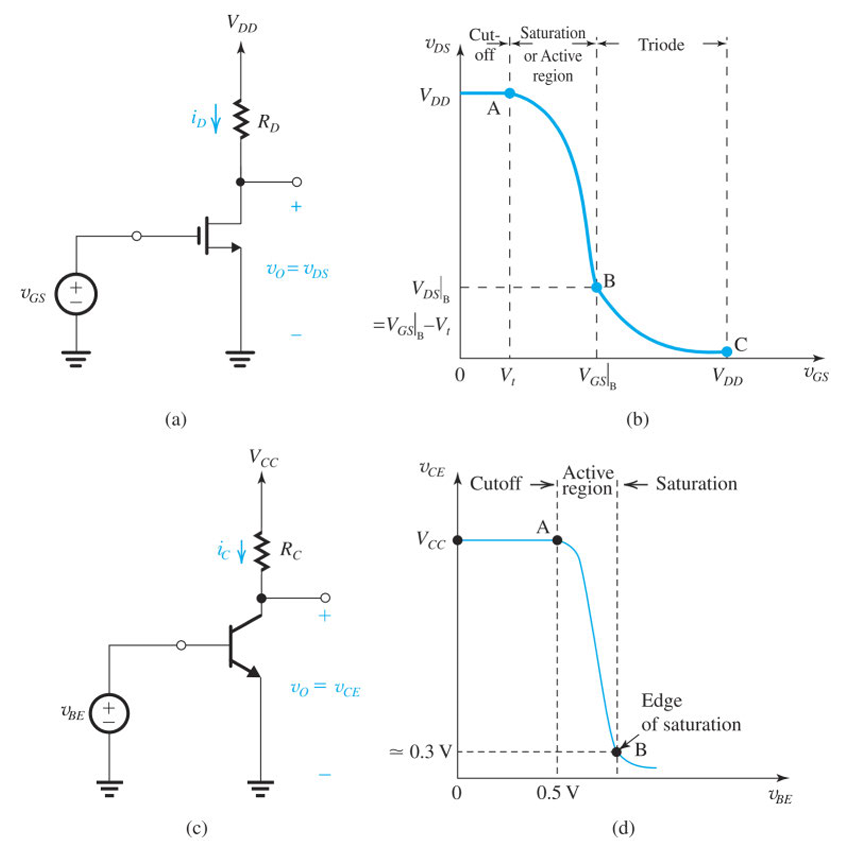
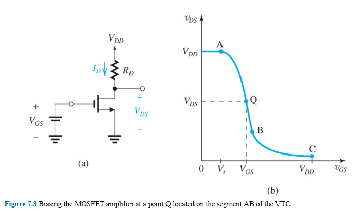
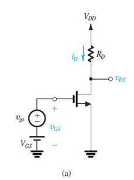
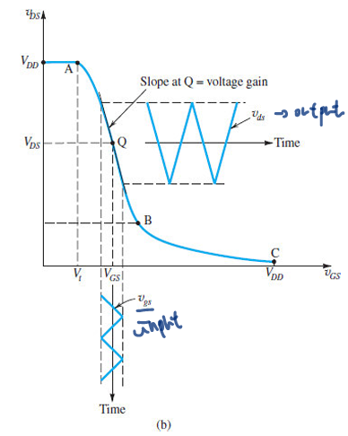

# Chapter 7, Transistor Amplifiers
> Using transistor as amplifier

- [Chapter 7, Transistor Amplifiers](#chapter-7-transistor-amplifiers)
- [Keys](#keys)
- [Introduction](#introduction)
- [7.1 Basic Principles](#71-basic-principles)
  - [7.1.1 The Basis for Amplifier Operation](#711-the-basis-for-amplifier-operation)
  - [7.1.2 Obtaining a Voltage Amplifier](#712-obtaining-a-voltage-amplifier)
  - [7.1.3 the Voltage-Transfer Characteristic (VTC)](#713-the-voltage-transfer-characteristic-vtc)
  - [7.1.4 Obtaining Linear Amplification by Biasing the Transistor](#714-obtaining-linear-amplification-by-biasing-the-transistor)
  - [7.1.5 The Small-Signal Voltage Gain](#715-the-small-signal-voltage-gain)
    - [7.1.5s MOSFET case](#715s-mosfet-case)
    - [7.1.5s BJT case](#715s-bjt-case)

# Keys
ehhhhh
- 7.1 Basic Principles
  - 7.1.1 The Basis for Amplifier Operation
  - 7.1.2 Obtaining a Voltage Amplifier
  - 7.1.3 The Voltage-Transfer Characteristic (VTC)
  - 7.1.4 Obtaining Linear Amplification by Biasing the Transistor
  - 7.1.5 The Small-Signal Voltage Gain
  - 7.1.6 Determining the VTC by Graphical Analysis
  - 7.1.7 Deciding on a Location for the Bias Point Q
- 7.2 Small-Signal Operation and Models
  - 7.2.1 The MOSFET case
  - 7.2.2 The BJT Case
  - 7.2.3 Summary Tables
- 7.3 Basic Configurations
  - 7.3.1 The Three Basic Configurations
- 7.4 Biasing
- 7.5 Discrete-Circuit Amplifiers

# Introduction
Two transistor applications:
- switch: digital circuits
- amplifier: analog circuits (a controlled source)

> Basic principles for MOSFET and BJT as amplifiers are the same, so we study them together and make comparisons. 

# 7.1 Basic Principles

## 7.1.1 The Basis for Amplifier Operation

> Input voltage versus output current equations, conditions for amplifier operation.

Condition for transistors to be operating as **voltage-controlled current source**:
- BJT in active mode
- MOSFET in saturation region (vGS controls iD)

> This chapter calls both "active mode (BJT)" and "saturation region (MOSFET)" as **active region**, in the textbook.
>
> Astelor: imma keep using saturation region to avoid confusion.

---

`(7.1)`

**NMOS**, vGS controls iD in saturation region:

$$i_D=\frac 12 k_n (v_{GS}-V_{tn})^2$$

- Drain current (iD) is independent of drain voltage (vDS)
  - → channel pinched-off
  - → neglecting Early effect
- Operation condition: ([saturation region](05-MOSFET.md/#516-operation-for-vds-≥-vov-channel-pinch-off-and-current-saturation))
  - vDS ≥ vOV, vOV = vGS - Vtn
  - → vGD ≤ Vtn 

`(7.2)`

**npn BJT**, vBE controls iC in active region:

$$i_C=I_Se^{v_{BE}/V_T}$$

- collector current (iC) is independent of collector voltage (vCE)
  - → collector-base junction (CBJ) is reverse-biased
  - → "isolating" the collector
- Operation condition (active mode)
  - CBJ reverse-bias (vCE ≥ 0.3V), vBE ≃ 0.7
  - → vBC ≤ 0.4V

## 7.1.2 Obtaining a Voltage Amplifier
> Use load resistor to turn output current into voltage

What we have:
- Transconductance amplifier (from [7.1.1](#711-the-basis-for-amplifier-operation))
  - input signal: voltage
  - output signal: **current**

What we want:
- Voltage amplifier
  - input signal: voltage
  - output signal: **voltage**

Making voltage amp from transconductance amp (the transistor)
- connect **RD** (load resistance)
- → convert the drain current into a voltage

For NMOS, the operation process:
- VDD is a constant
- The gate voltage (vGS) controls the drain current (iD)
  - With load resistance (RD, resistor at drain).
  - → Drain current (iD) controls the drain voltage (vDS)
- Thus, vGS → iD → vDS.
  - Now we have a voltage-controlled voltage source
  - → a voltage amplifier

> ◈ TL;DR
>
> - Transistor is voltage→current amp
> - So we connect a resistor to make the output current into a voltage
> 

Similar arrangement can be applied to **NPN-BJT** as well.

`(7.3)`

The output voltage (vDS):

$$v_{DS}=V_{DD}-i_D R_D$$

`(7.4)`

The output voltage (vCE):

$$v_{CE}=V_{CC}-i_C R_C$$

## 7.1.3 the Voltage-Transfer Characteristic (VTC)

> This section is about explanation to the vGS-vDS graph at [7.1.2](#712-obtaining-a-voltage-amplifier)
>
> Don't let combined expression for an equation scare you!

`(7.5)`

**NMOS**: Substituting iD in Eq.(7.3) by its active-region value from Eq.(7.1)

$$v_{DS}=V_{DD}-\frac 12 k_n R_D (v_{GS}-V_t)^2$$

---

**Point B** is the boundary between the saturation and triode region.
- vDS < (vGS-Vtn) 
  - → condition for triode region
- when vDS = vOV 
  - → point B on the vDS-vGS plot

`!(7.6)`

Determine the coordinate of **point B**:

By substituting in Eq.(7.5)

$$V_{GS}|_B=V_t+ \frac {\sqrt{2k_n R_D V_{DD} +1}-1}{k_n R_D}$$

- vGS = VGS|B
- vDS = VDS|B = VGS|B - Vt
  - = VOV|B

`(7.7)`

And point B can alternatively be characterized by the overdrive voltage

$$V_{OV}|_B =V_{GS}|_B - \frac{\sqrt{2k_nR_D V_{DD}+1}-1}{k_n R_D}$$

and

`(7.8)`

$$V_{DS}|_B=V_{OV}|_B$$

> ◈ TL;DR
>
> - Find point B (on vGS)
> - why? because point A is cutoff to active region voltage
>   - It is the voltage required to turn the transistor on
>   - Point A is **pre-defined**!
> 

**NPN-BJT**, similar development applies:

`(7.9)`

$$v_{CE}=V_{CC}-R_C I_S e^{v_{BE}/V_T}$$

## 7.1.4 Obtaining Linear Amplification by Biasing the Transistor

> **v → V : theoretical → controllable**, and use the "almost linear" slope at active region.

- VGS: bias voltage 
  - selected for operation at point Q
- Point Q: bias point
  - aka dc operating point
  - At Q no signal component is present.
  - → aka quiescent point (hence the symbol)

**NMOS:**

`(7.10)`

$$V_{DS}=V_{DD} - \frac 12 k_n R_D (V_{GS}-V_t)^2$$

$$v_{GS}(t)=V_{GS}+v_{gs}(t)$$

- vgs: input signal
- VGS: bias voltage
- vGS: total instantaneous value

> ◈ TL;DR
> 
> Setting up (bias):
> - Set point Q (bias point/dc operation point) with VGS (bias voltage)
>   - typically 1/2 VDD
> 
> Creating amplified signal:
> - Funnel signal voltage (vgs) in with bias voltage (VGS)
> - Create total instantaneous value (vGS)

Normal operation:
- vgs is small enough to stay within point A and B.
- The shorter the segment, the greater the linearity achieved.

> ◈ TL;DR
> 
> Input signal sweep vs distortion:
> - Good:
>   - vgs small
>   - no distortion
> - Ehh:
>   - vgs larger
>   - a little distortion at the tip of waveform
> - Bad:
>   - vgs exceeds linear plot
>   - peaks of waveform shaved off (badly distorted)
>
> Conclusion:
> - The shorter the segment (vgs smaller), the greater the linearity (distortion lesser)

Similarly applied to **NPN-BJT:**

`(7.11)`

Bias point Q:

$$V_{CE}=V_{CC}-R_C I_S e^{V_{BE}/V_T}$$

`(7.12)`

DC current:

$$I_C=I_S e^{V_{BE}/V_T}$$

Superimposing a small-signal (vbe) on dc bias voltage (VBE):

$$v_{BE}(t)=V_{BE}+v_{be}(t)$$

## 7.1.5 The Small-Signal Voltage Gain

### 7.1.5s MOSFET case

- Input signal (vgs) **small**
- Almost-linear segment of VTC
- → output vds nearly proportional to vgs
- → **slope** of the segment of VTC at point Q
- → voltage gain of the amplifier (the slope's tangent)

> The VTC plot is still not a straight line, but close to one.

`(7.13)`

Finding the slope of the **tangent** to VTC at point Q:

$$A_v= \frac {d\, v_{DS}}{d\, v_{GS}} |_{v_{GS} = V_{GS}}$$

- vGS = VGS:
  - Total instantaneous value = bias voltage
  - → small signal = 0
- Tangent value → voltage gain:
  - dy/dx → output voltage/ input voltage

`(7.14)`

Using Eq.(7.5)

$$A_v= -k_n (V_{GS}-V_t) R_D$$

`!(7.15)`

Expressing in terms of the overdrive voltage (VOV):

$$A_v = -k_n V_{OV}R_D$$

1. The gain is negative
   - → The amp is inverting
   - 180° phase shift between input and output.
2. The gain is proportional to the load resistance RD.
   - to transistor transconductance parameter kn
   - to overdrive voltage VOV

> ◈ TL;DR
> - Make input small
> - Output is almost linear
> - Voltage gain is the VTC slope tangent
> - Voltage gain is negative
> - Eq. (7.15) :)

Dc current in the drain at the bias point:

$$I_D=\frac 12 k_n V_{OV}^2$$

- It's related to VOV

`(7.16)`

Combining the equation above with Eq.(7.15) to obtain:

$$A_v=\frac {I_D R_D}{V_{OV}/2}$$

- Ratio of dc voltage drop across load resistance (RD) to VOV/2
  - This is just Eq.(7.15) conversion, VOV/2 is the result to it.

`(7.17)`

Alternative form:

$$A_v = \frac{V_{DD}-V_{DS}}{V_{OV}/2}$$

Maximum gain magnitude:

$$|A_{v \max}| = \frac{V_{DD}-V_{DS}|_B}{V_{OV}|_B/2}$$

- The maximum slope of VTC (amp output)
  - → at point B
- Obtained by biasing transistor at point B (VGS|B)

`(7.18)`

Since VDS|B=VOV|B ([more about point B](#713-the-voltage-transfer-characteristic-vtc))

$$|A_{v\max}| = \frac {V_{DD}-V_{OV}|_B}{V_{OV}|_B /2}$$

- VOV|B is given by Eq.(7.7)

> ◈ TL;DR
> - Getting max possible gain for NMOS
> - → biasing transistor at point B
> - → no room for negative output signal swing

### 7.1.5s BJT case

> Similar development from the previous case

`(7.19)`

$$A_v = \frac {d\, v_{CE}}{d\, v_{BE}}|_{v_{BE}=V_{BE}}$$

`(7.20)`

Using Eq.(7.9) with Eq.(7.12)

$$A_v=-(\frac{I_C}{V_T})R_C$$

