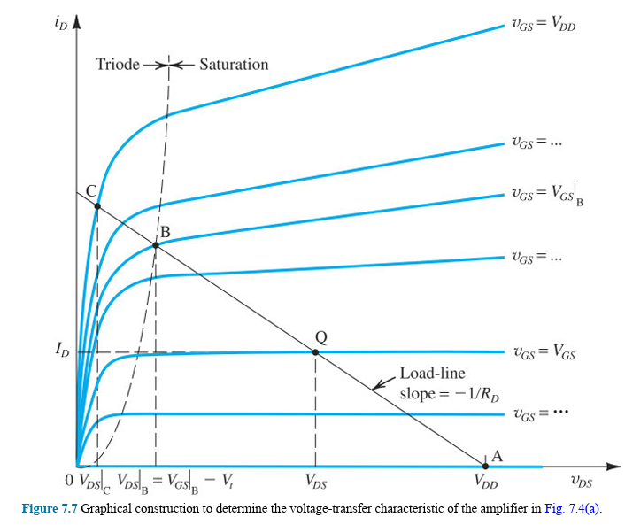
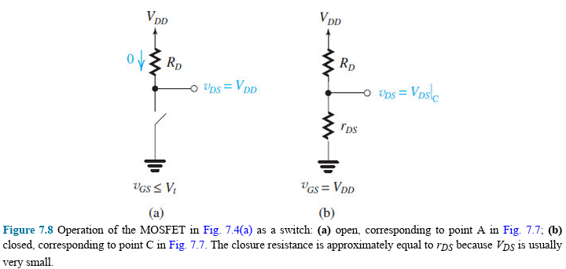
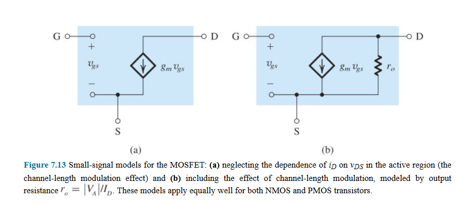
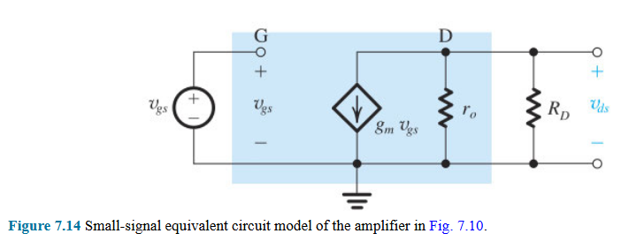
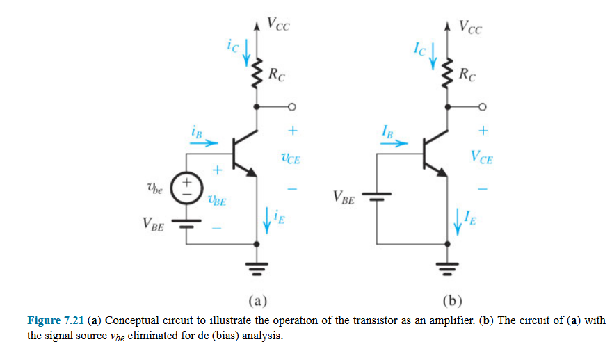

# Chapter 7, Transistor Amplifiers
> Using transistor as amplifier

- [Chapter 7, Transistor Amplifiers](#chapter-7-transistor-amplifiers)
- [Keys](#keys)
- [Introduction](#introduction)
- [7.1 Basic Principles](#71-basic-principles)
  - [7.1.1 The Basis for Amplifier Operation](#711-the-basis-for-amplifier-operation)
  - [7.1.2 Obtaining a Voltage Amplifier](#712-obtaining-a-voltage-amplifier)
  - [7.1.3 the Voltage-Transfer Characteristic (VTC)](#713-the-voltage-transfer-characteristic-vtc)
  - [7.1.4 Obtaining Linear Amplification by Biasing the Transistor](#714-obtaining-linear-amplification-by-biasing-the-transistor)
  - [7.1.5 The Small-Signal Voltage Gain](#715-the-small-signal-voltage-gain)
    - [7.1.5s MOSFET case](#715s-mosfet-case)
    - [7.1.5s BJT case](#715s-bjt-case)
  - [7.1.6 Determining the VTC by Graphical Analysis](#716-determining-the-vtc-by-graphical-analysis)
  - [7.1.7 Deciding on a Location for the Bias Point Q](#717-deciding-on-a-location-for-the-bias-point-q)
- [7.2 Small-Signal Operation and Models](#72-small-signal-operation-and-models)
  - [7.2.1 The MOSFET Case](#721-the-mosfet-case)
    - [7.2.1-1 DC Bias Point](#721-1-dc-bias-point)
    - [7.2.1-2 Signal Current in the Drain Terminal](#721-2-signal-current-in-the-drain-terminal)
    - [7.2.1-3 Voltage Gain](#721-3-voltage-gain)
    - [7.2.1-4 Small-Signal Equivalent-Circuit Models](#721-4-small-signal-equivalent-circuit-models)
    - [7.2.1-5 The Transconductance gm](#721-5-the-transconductance-gm)
  - [7.2.2 The BJT Case](#722-the-bjt-case)
    - [7.2.2-1 Dc Bias Point](#722-1-dc-bias-point)
    - [7.2.2-2 Collector Current and the Transconductance](#722-2-collector-current-and-the-transconductance)

# Keys
ehhhhh
- 7.1 Basic Principles
  - 7.1.1 The Basis for Amplifier Operation
  - 7.1.2 Obtaining a Voltage Amplifier
  - 7.1.3 The Voltage-Transfer Characteristic (VTC)
  - 7.1.4 Obtaining Linear Amplification by Biasing the Transistor
  - 7.1.5 The Small-Signal Voltage Gain
  - 7.1.6 Determining the VTC by Graphical Analysis
  - 7.1.7 Deciding on a Location for the Bias Point Q
- 7.2 Small-Signal Operation and Models
  - 7.2.1 The MOSFET case
  - 7.2.2 The BJT Case
  - 7.2.3 Summary Tables
- 7.3 Basic Configurations
  - 7.3.1 The Three Basic Configurations
- 7.4 Biasing
- 7.5 Discrete-Circuit Amplifiers

# Introduction
Two transistor applications:
- switch: digital circuits
- amplifier: analog circuits (a controlled source)

> Basic principles for MOSFET and BJT as amplifiers are the same, so we study them together and make comparisons. 

# 7.1 Basic Principles

## 7.1.1 The Basis for Amplifier Operation

> Input voltage versus output current equations, conditions for amplifier operation.

Condition for transistors to be operating as **voltage-controlled current source**:
- BJT in active mode
- MOSFET in saturation region (vGS controls iD)

> This chapter calls both "active mode (BJT)" and "saturation region (MOSFET)" as **active region**, in the textbook.
>
> Astelor: imma keep using saturation region to avoid confusion.

---

`(7.1)`

**NMOS**, vGS controls iD in saturation region:

$$i_D=\frac 12 k_n (v_{GS}-V_{tn})^2$$

- Drain current (iD) is independent of drain voltage (vDS)
  - → channel pinched-off
  - → neglecting Early effect
- Operation condition: ([saturation region](05-MOSFET.md/#516-operation-for-vds-≥-vov-channel-pinch-off-and-current-saturation))
  - vDS ≥ vOV, vOV = vGS - Vtn
  - → vGD ≤ Vtn 

---

`(7.2)`

**npn BJT**, vBE controls iC in active region:

$$i_C=I_Se^{v_{BE}/V_T}$$

- Collector current (iC) is independent of collector voltage (vCE)
  - → collector-base junction (CBJ) is reverse-biased
  - → "isolating" the collector
- Operation condition (active mode)
  - CBJ reverse-bias (vCE ≥ 0.3V), vBE ≃ 0.7
  - → vBC ≤ 0.4V

## 7.1.2 Obtaining a Voltage Amplifier
> Use load resistor to turn output current into voltage

What we have:
- Transconductance amplifier (from [7.1.1](#711-the-basis-for-amplifier-operation))
  - input signal: voltage
  - output signal: **current**

What we want:
- Voltage amplifier
  - input signal: voltage
  - output signal: **voltage**

Making voltage amp from transconductance amp (the transistor)
- connect **RD** (load resistance)
- → convert the drain current into a voltage

For NMOS, the operation process:
- VDD is a constant
- The gate voltage (vGS) controls the drain current (iD)
  - With load resistance (RD, resistor at drain).
  - → Drain current (iD) controls the drain voltage (vDS)
- Thus, vGS → iD → vDS.
  - Now we have a voltage-controlled voltage source
  - → a voltage amplifier

> ◈ TL;DR
>
> - Transistor is voltage→current amp
> - So we connect a resistor to make the output current into a voltage
> 

---

Similar arrangement can be applied to **NPN-BJT** as well.

`(7.3)`

The output voltage (vDS):

$$v_{DS}=V_{DD}-i_D R_D$$

`(7.4)`

The output voltage (vCE):

$$v_{CE}=V_{CC}-i_C R_C$$

## 7.1.3 the Voltage-Transfer Characteristic (VTC)

> This section is about explanation to the vGS-vDS graph at [7.1.2](#712-obtaining-a-voltage-amplifier)
>
> Don't let combined expression for an equation scare you!

`!(7.5)`

**NMOS**: Substituting iD in Eq.(7.3) by its active-region value from Eq.(7.1)

$$v_{DS}=V_{DD}-\frac 12 k_n R_D (v_{GS}-V_t)^2$$

**Point B** is the boundary between the saturation and triode region.
- vDS < (vGS-Vtn) 
  - → condition for triode region
- when vDS = vOV 
  - → point B on the vDS-vGS plot

`!(7.6)`

Determine the coordinate of **point B**:

By substituting in Eq.(7.5)

$$V_{GS} |_ B = V_t + \frac { \sqrt {2 k_n R_D V _{DD} +1} -1}{k_n R_D}$$

- vGS = VGS|B
- vDS = VDS|B = VGS|B - Vt
  - = VOV|B

`(7.7)`

And point B can alternatively be characterized by the overdrive voltage

$$V_{OV}|_ B = V _ {GS} | _ B - \frac{\sqrt{2 k_n R_D V _{DD}+1}-1}{k_n R_D}$$

and

`(7.8)`

$$V_{DS}|_ B = V _{OV} |_B$$

> ◈ TL;DR
>
> - Find point B (on vGS)
> - why? because point A is cutoff to active region voltage
>   - It is the voltage required to turn the transistor on
>   - Point A is **pre-defined**!
> 

---

**NPN-BJT**, similar development applies:

`(7.9)`

$$v_{CE}=V_{CC}-R_C  I_S e^{v_{BE}/V_T}$$

## 7.1.4 Obtaining Linear Amplification by Biasing the Transistor

> **v → V : theoretical → controllable**, and use the "almost linear" slope at active region.

- VGS: bias voltage 
  - selected for operation at point Q
- Point Q: bias point
  - aka dc operating point
  - At Q no signal component is present.
  - → aka quiescent point (hence the symbol)

**NMOS:**

`(7.10)`

$$V_{DS}=V_{DD} - \frac 12 k_n R_D (V_{GS}-V_t)^2$$

$$v_{GS}(t)=V_{GS}+v_{gs}(t)$$

- vgs: input signal
- VGS: bias voltage
- vGS: total instantaneous value

> ◈ TL;DR
> 
> Setting up (bias):
> - Set point Q (bias point/dc operation point) with VGS (bias voltage)
>   - typically 1/2 VDD
> 
> Creating amplified signal:
> - Funnel signal voltage (vgs) in with bias voltage (VGS)
> - Create total instantaneous value (vGS)

Normal operation:
- vgs is small enough to stay within point A and B.
- The shorter the segment, the greater the linearity achieved.

> ◈ TL;DR
> 
> Input signal sweep vs distortion:
> - Good:
>   - vgs small
>   - no distortion
> - Ehh:
>   - vgs larger
>   - a little distortion at the tip of waveform
> - Bad:
>   - vgs exceeds linear plot
>   - peaks of waveform shaved off (badly distorted)
>
> Conclusion:
> - The shorter the segment (vgs smaller), the greater the linearity (distortion lesser)

Similarly applied to **NPN-BJT:**

`(7.11)`

Bias point Q:

$$V_{CE}=V_{CC}-R_C I_S e^{V_{BE}/V_T}$$

`(7.12)`

DC current:

$$I_C=I_S e^{V_{BE}/V_T}$$

Superimposing a small-signal (vbe) on dc bias voltage (VBE):

$$v_{BE}(t)=V_{BE}+v_{be}(t)$$

## 7.1.5 The Small-Signal Voltage Gain

> Gain of small signal.

### 7.1.5s MOSFET case

Conditions:
- Input signal (vgs) **small**
- Almost-linear segment of VTC
- → output vds nearly proportional to vgs
- **Slope** of the segment of VTC at point Q
- → voltage gain of the amplifier (the slope's tangent)

> The VTC plot is still not a straight line, but close to one.
>
> The concept of "proportional" is related to the "slope", the linearity.

`(7.13)`

Finding the slope of the **tangent** to VTC at point Q:

$$A_v= \frac {d  v_{DS}}{d  v_{GS}} |_ {v_{GS} = V_{GS}}$$

- vGS = VGS:
  - Total instantaneous value = bias voltage
  - → small signal value = 0 V
- Tangent value → voltage gain:
  - dy/dx → output voltage/ input voltage

`(7.14)`

Using Eq.(7.5) → the equation for vDS

$$A_v= -k_n (V_{GS}-V_t) R_D$$

`!(7.15)`

Expressing in terms of the overdrive voltage (VOV):

$$A_v = -k_n V_{OV}R_D$$

Observations to the voltage gain:
1. The gain is negative
   - → The amp is inverting
   - 180° phase shift between input and output.
2. The gain is proportional...
   - to the load resistance (RD)
   - to transistor transconductance parameter (kn)
   - to overdrive voltage (VOV)

> ◈ TL;DR
> - Make input small
> - Output is almost linear
> - Voltage gain is the VTC slope tangent
> - Voltage gain is negative
> - Eq. (7.15) :)

> Additional insights by tweaking the equations:

Dc current in the drain at the bias point:

$$I_D=\frac 12 k_n V_{OV}^2$$

`(7.16)`

Combining the equation above with Eq. (7.15) to obtain:

$$A_v=\frac {I_D R_D}{V_{OV}/2}$$

- (Observation) Ratio of dc voltage drop across load resistance (RD) to VOV/2
  - This is just Eq.(7.15) conversion, VOV/2 is the result to it.

`(7.17)`

Alternative form:

$$A_v = \frac{V_{DD}-V_{DS}}{V_{OV}/2}$$

Maximum gain magnitude:

$$|A_{v \max}| = \frac{V_{DD}-V_{DS}|_ B} {V_{OV}|_B/2}$$

- The maximum slope of VTC (amp output)
  - → at point B
  - the steepest slope
- Obtained by biasing transistor at point B (VGS|B)

`(7.18)`

Since VDS|B=VOV|B ([more about point B](#713-the-voltage-transfer-characteristic-vtc))

$$|A_{v\max}| = \frac {V_{DD}-V_{OV}|_ B} {V_{OV}|_B /2}$$

- VOV|B is given by Eq.(7.7)

> ◈ TL;DR
> - Getting max possible gain for NMOS.
> - → biasing transistor at point B.
> - → no room for negative output signal swing.

### 7.1.5s BJT case

> Similar development from the previous case

`(7.19)`

$$A_v = \frac {d v_{CE}}{d v_{BE}}|_ {v_{BE}=V_{BE}}$$

`(7.20)`

Using Eq.(7.9) with Eq.(7.12)

$$A_v=-(\frac{I_C}{V_T})R_C$$

Observations to the voltage gain:
1. The gain is negative
   - → the amplifier is inverting
   - 180° phase shift between input and output
2. The gain is proportional...
   - to the collector current (IC)
   - to the load resistance (RC)

> Additional insight:

`(7.21)`

$$A_c = - \frac{I_C R_C} {V_T}$$

- Ratio of the voltage drop across the load resistance (RC) to the thermal voltage (VT)
  - VT ≃ 25mV at room temperature
- Similar in form to that for the MOSFET (Eq. 7.16)
  - VOV/2 → design parameter
  - VT → physical constant
- Typically VOV/2 > VT
  - → Higher gain from BJT than MOSFET
- **Exponential** relationship (iC-vBE) is much steeper than square-law relationship (iD-vGS).
  - Higher gain!

`(7.22)`

Expressing Eq. (7.21) alternatively:

$$A_v = -\frac {V_{CC}-V_{CE}}{V_T}$$

- Lowest possible VCE (accounting negative signal swing)
- → Maximum possible gain amplitude (|Av|)

`(7.23)`

Maximum gain → VCE = 0.3V

$$|A_ {v\max}|= \frac{V_{CC}-0.3} {V _T }$$

- Theoretical maximum.
- → Biasing transistor at the edge of saturation mode. 
- → Leaving no room for negative signal swing at the output.

> Even if BJT has larger voltage gain, it doesn't make BJT preferred to the MOSFET in the design of modern integrated-circuit amplifier.
>
> MOSFET is better, even if its voltage gain is smaller.

## 7.1.6 Determining the VTC by Graphical Analysis

> Good for learning, bad (rarely used) for practicing.

- Locating the bias point Q 

`(7.24)`

The **load line**:

$$i _ D = \frac{V_ {DD}}{R _ D} - \frac{1}{R_D} v _{DS}$$

Graphical Analysis:
- For each value of vGS
- → It has a plot of iD-vDS
- Load line slope (-1/RD)
- VDD is a constant, vDS is the output

> For each change of vGS, the a new line of iD-vDS can be plotted. And the new iD-vDS line corresponds with the new vGS will intersect with the load line.
>
> Vt (threshold voltage) < VGS (bias voltage) < VDD

Intersection of load line: 
- Point A → vGS = Vt
  - On saturation and cutoff boundary.
- Point Q → amplifier operation
  - In saturation region.
- Point B → vGS = VGS|B
  - On triode and saturation boundary.
- Point C → vGS = VDD
  - In triode region.

> Astelor: Wait this considers channel-length modulation? ([iD-vDS characteristic](05-MOSFET.md/#522s-graph)), ([finite output resistance](05-MOSFET.md/#524-finite-output-resistance-in-saturation))

At point A:
- Used as a open switch (give voltage = on)

At point C:
- Used as a close switch (give more voltage = off)
- Transistor operates as a low-valued resistance rDS
- Has a small voltage drop.
- → The incremental resistance is the **closure resistance**.

> Astelor: what is this.
> Astelor: Do I need to calculate the voltage or current at triode region?

## 7.1.7 Deciding on a Location for the Bias Point Q

Location for point Q:

- Required gain
- Desired signal swing

MOSFET:

- Cutoff → positive peak
  - Not enough headroom
- Triode region → negative peak
  - Not enough legroom

# 7.2 Small-Signal Operation and Models

> Exploring the small-signal operation in greater detail

## 7.2.1 The MOSFET Case

Condition:

- Apply bias voltage (VGS)
- Superimpose input signal (vgs)
  - → Total instantaneous voltage (VGS+vgs=vGS)
- Output voltage → the drain voltage (vDS)

### 7.2.1-1 DC Bias Point

Condition:

- Setting input signal (vgs) to zero
- → Total instantaneous voltage (vGS) 
  - = the bias voltage (VGS)
- → Dc bias current (ID)
- Neglecting channel-length modulation 
  - → Assuming device parameter λ = 0

Operation:

- Overdrive voltage: $V_{OV} = V_{GS} - V_t$
- Ensure saturation-region operation: $V_{DS} > V_{OV}$

`(7.25)`

Dc bias current (ID):

$$I_D=\frac 12 k_n (V_{GS} - V_t)^2 = \frac 12 k_n V_{OV}^2$$

`(7.26)`

**Dc voltage** at the drain (VDS):

$$V_{DS} = V_{DD} - I_D R_D$$

### 7.2.1-2 Signal Current in the Drain Terminal

Condition:

- Apply input signal (vgs)
- → Total instantaneous voltage (vGS) 
  - = the bias voltage (VGS) + input signal (vgs)
- → Total instantaneous drain current (iD)

`(7.27)`

Total instantaneous gate-to-source voltage:

$$v_{GS} = V_{GS} + v_{gs}$$

`(7.28)`

Total instantaneous drain current:

$$
\begin{align*}
i_D &= \frac 12 k_n ( V_{GS} + v_{gs} - V_t)^2 \\
    &= \frac 12 k_n ( V_{GS} + V_t )^2 + k_n (V_{GS} - V_t)v_{gs} + \frac 12 k_n v_{gs}^2
\end{align*}
$$

Observation to Eq. (7.28):

- First term: Dc bias drain current (ID)
- Second term: current component proportional to vgs
  - recall kn → A/V^2
- Third term: current component proportional to **vgs^2**
  - Bad
  - → Nonlinear distortion

For the **nonlinear third term**:

- To reduce nonlinear distortion
  - → amplitude vgs small
  - → third term ≪ second term
- → The small-signal condition

$$\frac 12 k_n v_{gs}^2 ≪ k_n (V_{GS} - V_t)v_{gs}$$

`(7.29)`, Resulting in:

$$v_{gs} ≪ 2 (V_{GS} - V_t)$$

`(7.30)` Or equivalently: 

$$v_{gs} ≪ 2 V_{OV}$$

- If the **small-signal condition** is satisfied
  - → The third term is negligible
- → Expressing the the total instantaneous current (iD) as Eq. (7.31) 

`(7.31)` 

$$i_D ≃ I_D + i_d$$

where

$$i_d = k_n (V_{GS} - V_t ) v_{gs}$$

`(7.32)`

MOSFET transconductance gm:

$$g_m ≡ \frac {i_d} {v_{gs}} = k_n (V_{GS} - V_t)$$

`(7.33)`

$$g_m = k_n V_{OV}$$

`(7.34)`

gm = slope of the iD-vGS characteristic at the bias point

$$g_m ≡ \frac {∂ i_D}{∂ v_{gs}} |_ {v_{GS}=V_{GS}} $$

### 7.2.1-3 Voltage Gain

Expressing the total instantaneous drain voltage:

$$v_{DS} = V_{DD} - R_D i_D$$

$$v_{DS} = V_{DD} - R_D (I_D + i_d)$$

$$v_{DS} = V_{DS} - R_D i_d$$

`!(7.35)`

Signal component of the drain voltage (vds):

$$v_{ds} = -i_d R_D = -g_m v_{gs} R_D$$

`(7.36)`

Voltage gain is given by:

$$A_v ≡ \frac {v_{ds}}{v_{gs}} = - g_m R_D$$

- Output signal (vds) is 180° out of phase with input signal (vgs)

### 7.2.1-4 Small-Signal Equivalent-Circuit Models

- Voltage-controlled current source
- Input resistance: ideally infinite
- Output resistance: high (assume infinite)
  - → The resistance looking into the drain

`(7.37)`

**[Finite resistance](05-MOSFET.md/#524-finite-output-resistance-in-saturation)** ro:

$$r_o = \frac {|V_A|} {I_D}$$

- VA: Early voltage = 1/λ
  - → specified or measured
  - → proportional to channel-length
  - λ: device parameter used in channel-length modulation

`(7.38)`

Dc drain current (ID) without the channel-length modulation:

$$I_D = \frac 12 k_n V_{OV}^2$$

- ro : 10kΩ ~ 1000kΩ
- Including ro in parallel with the controlled source
  - → Accounting for the channel-length modulation

`(7.39)`

Voltage gain from:
- Replace the transistor with the small-signal model
- Eliminating the dc sources

$$A_v = \frac {v_{ds}} {v_{gs}} = -g_m (R_D || r_o)$$

> Eq. (7.36) with channel-length modulation
>
> The voltage-controlled current source (gm * vgs) is shunted by the finite resistance (ro).

### 7.2.1-5 The Transconductance gm

`!(7.40)`

$$g_m = k_n' (W/L) ( V_{GS}-V_t ) = k_n' (W/L) V_{OV}$$

gm is proportional to...

- The process transconductance (kn')
  - $k_n' = μ_n C_{ox}$ (A/V^2)
- Aspect ratio (W/L)
  - Large transconductance
  - → W large L small (device short and wide)
- Overdrive voltage (VOV)
  - VOV = VGS - Vt

`(7.41)`

Substituting $\sqrt{2I_D / (k_n'(W/L))}$ from Eq.(7.25) for VOV in Eq.(7.40)

$$g_m = \sqrt{2 k_n'} \sqrt{W/L} \sqrt{I_D}$$

1. For a given MOSFET, gm is proportional to the square root of the dc bias current.
2. At a given bias current,gm is proportional to $\sqrt{W/L}$

`(7.42)`

Substituting $k_n'(W/L)$ by $2 I_D / (V _{GS} - V_t)^2$

$$g_m = \frac {2 I_D}{V_{GS} - V_t} = \frac {2 I_D}{V_{OV}} =  \frac{I_D}{V_{OV}/2}$$

## 7.2.2 The BJT Case

### 7.2.2-1 Dc Bias Point

`(7.52)`

$$I_C = I_S e^{v_{BE}/V_T}$$

`(7.53)`

$$I_E = I_C/ \alpha$$

`(7.54)`

$$I_B = I_C/ \beta$$

`(7.55)`

$$V_{CE} = V_{CC} - R_C I_C$$

### 7.2.2-2 Collector Current and the Transconductance

$$v_{BE} = V_{BE} + v_{be}$$

