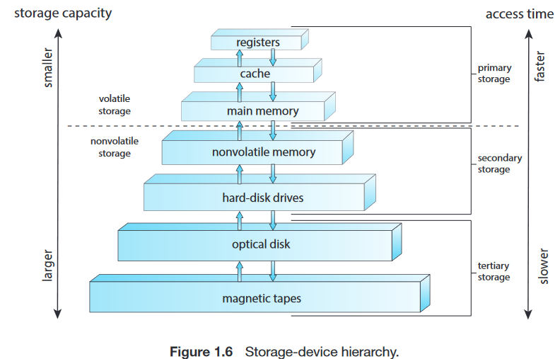

# 1. introduction

> no first word cap we die like men
> 
> caps are used only for acronyms, italics will be used on emphasis, bold is for keywords that are not necessarily specialty keywords

**table of contents**
- [1. introduction](#1-introduction)
- [1.1. what operating systems do](#11-what-operating-systems-do)
  - [1.1.1. user view](#111-user-view)
  - [1.1.2. system view](#112-system-view)
  - [1.1.3. defining operating systems](#113-defining-operating-systems)
- [1.2. computer-system organization](#12-computer-system-organization)
  - [1.2.1. interrupts](#121-interrupts)
    - [1.2.1.1. overview](#1211-overview)
    - [1.2.1.2. implementation](#1212-implementation)
  - [1.2.2. storage structure](#122-storage-structure)
  - [1.2.3. I/O structure](#123-io-structure)
- [1.3. computer-system architecture](#13-computer-system-architecture)
  - [1.3.1. single-processor systems](#131-single-processor-systems)
  - [1.3.2. multiprocessor systems](#132-multiprocessor-systems)
- [glossary](#glossary)

# 1.1. what operating systems do

a computer system's components:
- hardware
  - computing resources for the system
  - e.g. central processing unit (CPU), memory, input/output (I/O) devices
- operating system
  - controls hardware
  - coordinate hardware usage among the `application programs` for users
    - resource distribution
  - *environment* for programs to work
- application programs
  - solve users' computing problems
  - e.g. word processors, compilers, web browsers
- user
  - you

## 1.1.1. user view

you (single user) on personal computer:
- user interface
  -  e.g. monitor, keyboard, touch screen, voice recognition
- monopolize all the resources
- **ease of use**
- maximize work
- no **resource utilization**

```
[user]
    ↕
[application programs]
(compilers, web browsers, etc)
    ↕
[operating system]
    ↕
[computer hardware]
(CPU, memory, I/O devices, etc)
```

**embedded computers**:
- in e.g. home devices, automobiles
- designed to run without user intervention

## 1.1.2. system view

the operating system is a:
- **resource allocator**
  - resources: e.g. CPU time, memory space, storage space, I/O devices
  - allocating resources to programs
  - to operate computer system efficiently and fairly
- **control program**
  - manages the execution of user programs
  - to prevent errors and improper use of the computer
  - especially the operation of I/O devices

## 1.1.3. defining operating systems

brief history of computer:
- fixed-purpose systems for military uses
  - e.g. census calculation, cipher decryption
- general-purpose, multifunction `mainframes`
  - operating systems were born
- 1960s `Moore's Law` predicted the number of transistors on ICs will double every 1.5 year (18 months)
- computer gained in functionality and shrank in size
  - vast number of uses and operating systems 

goal of computer system:
- execute programs
- make solving user problems easier 

definition of an OS:
- no universally accepted definition of OS
- everything a vendor ships when you order "the operating system"
  - features included vary greatly across systems
- the one program running *at all times* on the computer
  - more common definition, the one we usually follow
  - called the **`kernel`**

`kernel`:
- along with **`system programs`** and **`application programs`**
- `system programs` are associated with the OS
  - not necessarily part of the `kernel`
- `application programs` are all programs not associated with the operation of the system
  - a computer can live without `application programs` 
  - but cannot live without `system programs`

too much features?
- in short, *microsoft got sued by the us government* in 1998 and was found guilty for including too much features in its OS, creating a monopoly using the OS.
- the features included in OS on mobile devices is increasing

mobile operating systems:
- include core `kernel` and `middleware`
- `middleware` is a set of software frameworks that provide additional services to application developers
  - e.g. supporting databases, multimedia, graphics

OS summary:
- `kernel` that is always running
- `middleware` frameworks for ease of app development + features
- `system programs` aid in managing the system

# 1.2. computer-system organization

modern general-purpose computer systems
- with one or more CPUs
- and a number of `device controllers`
- *all* connect through a common **`bus`**
  - provide access between components and shared memory

`device controller`:
- in charge of a *specific type* of device
- more than one device may be attached
  - depending on the controller
  - e.g. USB controller 
- contains...
  - local buffer storage 
  - a set of special-purpose registers
- responsible for...
  - moving data between peripheral devices
  - controlling its local buffer storage

OSs have a `device driver` for each `device controller`:
- `device driver` understands the `device controller`
  - provides the OS with a *uniform interface* to the device
- CPU and `device controllers` can execute in parallel
  - competing for memory cycles
  - a memory controller synchronize access to the shared memory
    - ensuring orderly access to the share memory

A typical PC "computer system":
```
        [disks]   [mouse] [keyboard] [printer]   [monitor]
            |            |      |     |             |
[CPU] [disk controller] [USB controller] [graphics adapter]
  |         |            |      |     |             |
  +---------+------------+------+-----+-------------+
    system bus      |
                [memory] (shared)
```

## 1.2.1. interrupts

a program performing I/O operation:
1. `device driver` loads appropriate registers in the `device controller`
2. `device controller` determines what action to make based on the contents in the registers
3. `device controller` start transferring data from the device to its local buffer
4. upon completion of transferring data, `device controller` informs `device driver` the operation is done
   - via an **`interrupt`** from `device controller`
5. `device driver` gives control to other parts of OS
   - or returns status information for other operations

### 1.2.1.1. overview

> go see [implementation](#1212-implementation) if you're already familiar with the terminologies

CPU interrupted:
1. stops what the CPU is doing
2. transfers execution to a fixed location
   - typically contains starting address of the service routine for the interrupt is located (???)
3. `interrupt service routine` executes
4. on completion, CPU resumes the interrupt computation

the `interrupt` must transfer control to the appropriate `interrupt service routine`.
1. invoke a generic routine to examine the interrupt information
2. the routine call the interrupt-specific handler

interrupt routine is called indirectly through the `interrupt vector`
- a *table of pointers* stored in low memory
- indexed by unique numbers (index on memory)
- hold addresses (value) of the `interrupt service routines` for the devices
- so the `interrupt handler` don't have to search all possible sources of interrupts to determine which one needs service.
- > it's the `interrupt vector` table you see in ARM processor manuals, that does the same thing

for example:
```
interrupt vector:
0x1 [address of routine 1]
0x2 [address of routine 2]
0x3 [address of routine 3]

interrupt vector[2] = address of routine 2
```

OSs (e.g. Windows, UNIX) do interrupts in this manner.

### 1.2.1.2. implementation

basic interrupt mechanism:
1. CPU detects that a controller asserted a signal on the `interrupt-request line`
   - CPU has a wire called the `interrupt-request line` that the CPU sense after executing every instruction
2. CPU read the interrupt number
3. CPU jumps to the `interrupt-handler routine` by using that interrupt number as an index into the `interrupt vector`
4. CPU starts execution (the routine) at the address associated with that index
- enables CPU to respond to an **asynchronous event**

`interrupt handler`:
1. saves any state it will be changing
2. determines the cause of the interrupt
   - from the `interrupt vector`
3. performs the necessary processing
4. performs a state restore
5. executes a `return_from_interrupt` instruction to return the CPU to the execution state prior to the interrupt

formal speak mapping to the basic interrupt mechanism:
1. `device controller` *raises* an interrupt
2. CPU *catches* the interrupt
3. CPU *dispatches* the interrupt to the `interrupt handler`
4. the handler *clears* the interrupt by servicing the device


modern OS need more sophisticated interrupt handling features:
1. ability to defer interrupt handling during critical processing
2. efficient way to dispatch to the proper `interrupt handler`
3. multilevel interrupts
   - OS can distinguish between high and low priority interrupts
   - and can respond with the appropriate degree of urgency
- the above are provided by CPU and the `interrupt-controller hardware`

(1)
most CPUs have two `interrupt request lines`:
- `nonmaskable interrupt`
  - *reserved* for events such as memory errors
  - on Intel processors: 0-31 are nonmaskable, used for various error conditions
- `maskable interrupt`
  - can be *turned off* by the CPU before the execution of critical instructions sequences that must not be interrupted
  - used by `device controllers` to request service
  - on Intel processors: 31-255 are maskable, used for device generated interrupts

(2)
`interrupt chaining`:
- in practice, computers have more devices than address elements in the `interrupt vector`
- each element in the `interrupt vector` points to the head of a list of `interrupt handlers`
- handlers on the corresponding list are called *one by one* until one is found that can service the request.
- a compromise between the overhead of a *huge interrupt table* and the inefficiency of dispatching to a *single `interrupt handler`*

(3)
`interrupt priority levels`:
- CPU to defer the handling of low-priority interrupts without masking all interrupts
- makes it possible for a high-priority interrupt to preempt the execution of a low-priority interrupt

summary:
- interrupts are used in OSs to handle asynchronous events
- `device controllers` and hardware faults raise interrupts
- interrupt is used heavily for *time-sensitive* processing
  - > you wouldn't want to wait 5 seconds to type each words
- efficient interrupt handling = good system performance
- `interrupt priorities` enable the most urgent work to be done first
  - > giving keyboard interrupt on terminals using `control+c` to stop anything immediately


## 1.2.2. storage structure

data and where they are stored to:
- CPU load instructions only from main memory → `RAM`, `DRAM`
  - `RAM` is frequently written to, volatile, smaller storage, faster
  - CPU *automatically* does it for execution from the location stored in the `program counter`
- `bootstrap program`/ `firmware` → erasable programmable read-only memory (`EEPROM`)
  - `bootstrap program` is the first program to run upon computer power-on
  - `EEPROM` is infrequently written to, nonvolatile, slower

execution cycle on systems with **`von Neumann architecture`**:
- fetch instruction in the `instruction register`
- instruction decoded
  - may cause operands to be fetched from memory
- instruction executed
- result may be stored back in memory

`von Neumann architecture` scheme:
```
[input device] [output device]
    ↓               ↑
+----------------------------+
| +-------------------------+ |
| | CPU                     | |
| | [control unit]          | |
| | [arithmetic/logic unit] | |
| +-------------------------+ |
|         ↓  ↑                |
|   [memory unit]             |
+-----------------------------+
```



storage hierarchy:
- `primary storage`: RAM
  - accessed directly by the CPU
  - volatile, smaller in storage, faster in reading to CPU
- `secondary storage`: SSD (nonvolatile memory), HDD
  - provide more storage
  - nonvolatile, larger in storage, slower than the former
- `tertiary storage`: optical disk, magnetic tapes
  - provide backup
  - nonvolatile, even larger in storage, slower
  - can holds data for a *long* time comparing to the former
    - thus used for special purposes

storage implementation technology:
- `semiconductor memory`: top four levels
  - most common form of NVM device is `flash memory`
  - fourth level is faster than hard disks

terminology (in this textbook):
- volatile storage → **memory**
- nonvolatile storage → **NVS**
  - mechanical: HDD, optical disks, holographic storage, magnetic tape
  - electrical → **NVM**

## 1.2.3. I/O structure

a large portion of OS code is dedicated to managing I/O for:
- reliability and performance of a system
- varying nature of the devices

> everything exchanges via a common bus, as mentioned earlier, but. 

**interrupt-driven I/O** (described in [section 1.2.1.](#121-interrupts)):
- can create *high overhead* when it's used for *bulk data movement* such as `NVS` I/O
  - e.g. moving data in and out of SSD
- but it's fine for moving small amounts of data

to solve the problem → **`direct memory access` (DMA)**:
- `device controller` transfers an entire *block of data* directly to or from the device and `main memory`
- only one interrupt is generated per *block*
  - to tell the `device driver` that the operation has completed
- rather than one interrupt per *byte* generated for low-speed devices
  - e.g. keyboard, mouse, such peripherals
- freeing CPU by making the `device controller` to perform these operations

some high-end systems use `switch` rather than bus architecture:
- multiple components can talk with each other *concurrently* rather than *competing for cycles* on a shared bus
- `DMA` is even more effective in this case


# 1.3. computer-system architecture

- computer system can be organized in a number of different ways
- categorize roughly according to the *number of general-purpose processors used*

## 1.3.1. single-processor systems

- one CPU with a single processing `core`
`core` is the component that executes instructions and registers for storing data locally (in the CPU)

## 1.3.2. multiprocessor systems

# glossary
- OS: operating system
- CPU: central processing unit
- USB: universal serial bus
- RAM: random-access memory
- DRAM: dynamic random-access memory
- ROM: read-only memory
- EEPROM: erasable programmable read-only memory
- HDD: hard-disk drive
- NVM: nonvolatile memory
- NVS: nonvolatile storage
- DMA: direct memory access