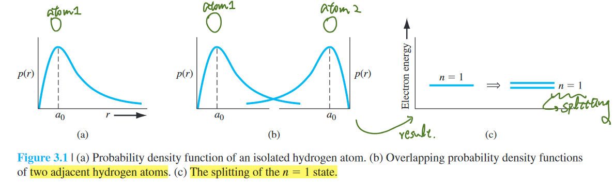

# chapter 3, introduction to the quantum theory of solids

**table of content**
- [chapter 3, introduction to the quantum theory of solids](#chapter-3-introduction-to-the-quantum-theory-of-solids)
- [3.1 allowed and forbidden energy bands](#31-allowed-and-forbidden-energy-bands)
  - [3.1.1 formation of energy bands](#311-formation-of-energy-bands)
  - [reminder](#reminder)

# 3.1 allowed and forbidden energy bands

## 3.1.1 formation of energy bands

- single atom
  - *radial probability density function* for the lowest electron energy state of the single, non-interacting hydrogen atom
- two atoms
  - overlap → interact
  - ---> splitting a *discrete quantized energy level* into two *discrete quantized energy levels*
  - ---> consistent with *Pauli exclusion principle*

- **Pauli exclusion principle**
  - *no two electrons can occupy the same quantum state*
  - the joining of atoms to form a system does not alter the *total number of quantum states*
  - ---> no two electrons can have the *same quantum number*, the discrete energy must *split into a band of energies* for each electrons to occupy a distinct quantum state

---
## reminder

- kinetic energy of an electron
  - $\Delta{E}=\frac{1}{2}mv^2$
- wave number
  - $k=\sqrt{\frac{2mE}{\bar{h}^2}}$
---