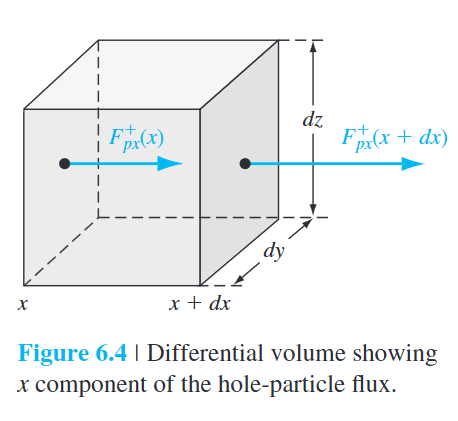

# chapter 6, non-equilibrium excess carriers in semiconductors

> oh well I need to remind myself every now and then there's actual stuff to study, not just the damn cryptography stuff. 
> at least the textbook I can understand, the papers on the other hand looks like literal ciphertexts to me

- excess carriers
  - occurs when an *external excitation* is applied to the semiconductor
- **ambipolar transport**
  - the excess electrons and holes do not move independently of each other

# 6.1 carrier generation and recombination

- **generation**
  - the process whereby electrons and holes are *created*
- **recombination**
  - the process whereby electrons and holes are *annihilated*

- example of **non-equilibrium condition**, *changing the carrier concentrations*
  - any deviation from thermal equilibrium
    - a sudden increase in temperature
  - an external excitation, such as light (a flux of photons)
- **direct band-to-band** generation and recombination
  - 1 free electron created = 1 hole created

## 6.1.1 the semiconductor in equilibrium

> tl;dr. 
> no external force = semiconductor in thermal equilibrium, in "dynamic equilibrium," and is **perfectly balanced**

- **thermal-generation rates**
  - $G_{n0}$, $G_{p0}$ for electrons and holes
  - units: $\#/cm^3-s$
  - for *direct band-to-band*: $G_{n0}=G_{p0}$
- **recombination rates** for a semiconductor in thermal equilibrium
  - $R_{n0}$, $R_{p0}$ for electrons and holes
  - units: $\#/cm^3-s$
  - for *direct band-to-band*: $R_{n0}=R_{p0}$
- **in thermal equilibrium**
  - the concentrations of electrons and holes are *independent of time*
  - $G_{n0}=G_{p0}=R_{n0}=R_{p0}$
  
## 6.1.2 excess carrier generation and recombination

> tl;dr. 
> yes external force = semiconductor having excess electrons and holes and in **non-equilibrium**

- the **excess carriers** are *generated* by an **external force** *at a particular rate*
    - perturbing the equilibrium condition
    - → semiconductor no longer in thermal equilibrium
    - **steady-state generation** of excess carriers will *not* cause a *continual buildup of the carrier concentrations*
      - electrons recombine with holes in pairs
        - electrons fall down to valence band and combine with holes 
- **generation rate** of *excess* electrons and holes
  - $g_n'$, $g_p'$
    - units: $\#/cm^3-s$
  - $g_n'=g_p'$ for *direct band-to-band*
    - the excess electrons and holes are created in pairs
- **electron and hole concentration** when excess carriers are created
  - $n=n_0+\delta n$
  - $p=p_0+\delta p$
  - $n_0$, $p_0$: thermal equilibrium concentrations
  - in such non-equilibrium condition: $np\ne n_0 p_0=n_i^2$
- **recombination rate** of *excess* electrons and holes
  - $R_n'$, $R_p'$
    - units: $\#/cm^3-s$
  - $R_n' = R_p'$ for *direct band-to-band*

### 6.1.2.a math derivation of carrier regeneration rate

> reminder: regeneration rate = recombination rate, for direct band-to-band ([6.1.2](#612-excess-carrier-generation-and-recombination))

- **net rate of change in the electron concentration** (given)
  - $\frac{dn(t)}{dt} = \alpha_r[n_i^2 - n(t)p(t)]$ 
    - $\alpha_r n_i^2$: thermal-equilibrium generation rate
    - $n(t) = n_0 + \delta n(t)$
    - $p(t) = p_0 + \delta p(t)$
    - **$\delta n(t) = \delta p(t)$**: excess electrons and holes are *created and recombined in pairs*
- **$\delta n(t) = \delta p(t)$**, substitute $n(t)$ to $n_0+\delta n(t)$
  - $\begin{align*} \frac{d(\delta n(t))}{dt} &= \alpha_r [n_i^2 -(n_0+\delta n(t))(p_0+\delta p(t))] \\&= -\alpha_r \delta n(t)[(n_0+p_0)+\delta n(t)] \end{align*}$
    - $n_0, p_0$ is independent of time
      - $n_0p_0=n_i^2$
    - can be solved under *low-level injection*
- considering **p-type** material, impose **low-level injection**
  - $\frac{d(\delta n(t))}{dt} = -\alpha_r p_0 \delta n(t)$
    - $p_0 \gg n_0$: *p-type* material 
    - $p_0 \gg \delta n(t)$: under *low-level injection*
      - $n_0, \delta n(t)$ terms are negligible, according to the limitations
- → solving the simplified equation
  - $\delta n(t) = \delta n(0)e^{-\alpha p_0 t} = \delta n(0)e^{-t/\tau_{n0}}$
    - *exponential decay* from the initial excess concentration
    - **$\tau_{n0} = (\alpha_r p_0)^{-1}$**: a constant for the low-level injection
      - aka **excess minority carrier lifetime**
      - > it's essentially a time constant
- → **recombination rate** of *excess minority carrier* of **electrons**
  - $R_n' = \frac{-d(\delta n(t))}{dt} =+ \alpha_r p_0 \delta n(t) = \frac{\delta n(t)}{\tau_{n0}}$
    - is defined as a positive quantity

- for direct band-to-band recombination, ***excess majority carrier* recombine at the same rate**
  - for **p-type** material
    - $R_n' = R_p' = \frac{\delta n(t)}{\tau_{n0}}$
  - for **n-type** material
    - $R_n' = R_p' = \frac{\delta n(t)}{\tau_{p0}}$
---
- considering **n-type** material, impose *low-level injection*
  - $n_0 \gg p_0$: *n-type* material
  - $n_0 \gg \delta n(t)$: under *low-level injection*
  - **$\tau_{p0} = (\alpha_r n_0)^{-1}$**: time constant
    - aka **excess minority carrier lifetime**

- **generation** & **recombination** rates may be functions of the *space coordinates* and *time*

### 6.1.2.b low and high level injection

- **low-level injection**
  - puts *limits* on the magnitude of the *excess carrier concentration* compared with the *thermal-equilibrium carrier concentrations*
  - **n-type** extrinsic material
    - $n_0 \gg p_0$
    - $n_0 \gg \delta p(t)$
  - **p-type** extrinsic material
    - $p_0 \gg n_0$
    - $p_0 \gg \delta n(t)$
- **high-level injection**
  - occurs when the *excess carrier concentration* becomes *comparable* to or greater than the *thermal-equilibrium majority carrier concentrations*
  - > not common to occur

# 6.2 characteristics of excess carriers

- **ambipolar transport**
  - excess electrons and holes *do not move independently of each other*
  - they *diffuse* and *drift* with the same *effective diffusion coefficient* and *effective mobility*
- **result**
  - for an *extrinsic semiconductor* under *low injection*
  - the *effective diffusion coefficient* and *mobility* parameters are those of the *minority carrier*

## 6.2.1 continuity equations

- **differential volume element** (figure 6.4)
  - where a one-dimensional *hole-particle flux*
    - → *entering* the differential element at *x*
    - → *leaving* the differential element at *x+dx*
- → for the *x component* of the *particle current density* shown
  - $F_{px}^{+}(x+dx) = F_{px}^{+}(x) \frac{\partial F_{px}^+}{\partial x}\cdot dx$
    - **$F_{px}^+$**: **hole-particle flux/flow**
      - units: number of holes/cm^2-s
    - *Taylor expansion* of $F_{px}^+ (x+dx)$
      - the *differential length* *dx* is small
      - only the *first two terms* in the expansion are significant

### 6.2.1.a math derivation of continuity equation

- the **net increase** in the *number of holes per unit time* within the *differential volume element* **due to the *x-component of hole flux*** (given)
  - $\frac{\partial p}{\partial t} dx\,dy\,dz = [F_{px}^+ (x) - F_{px}^+ (x+dx)]dy\,dz = -\frac{\partial F_{px}^+}{\partial x}dx\,dy\,dz$
  - if $F_{px}^+ > F_{px}^+ (x+dx)$
    - there wil be a net increase in the number of holes in the differential volume element with time
  - > - if we generalize to a *three-dimensional hole flux*, the right side of the equation may be written as $\nabla\cdot F_{px}^+ dx\,dy\,dz$
    >   - $\nabla\cdot F_{p}^+$: divergence of flux vector
    >   - we will limit ourselves to one-dimensional analysis
- the *generation rate* & *recombination rate of holes* will also affect the *hole concentration* in the *differential volume*
- the **net increase** in the *number of holes per unit time* in the *differential volume element* (given)
  - $\frac{\partial p}{\partial t} dx\,dy\,dz = -\frac{\partial F_p^+}{\partial x} dx\,dy\,dz + g_p dx\,dy\,dz - \frac{p}{\tau_{pt}}dx\,dy\,dz$
    - $p$: number of holes
    - $\frac{p}{\tau_{pt}}$: recombination rate for holes. ([regen rate and recom rate](#612a-math-derivation-of-carrier-regeneration-rate))
    - **$\tau_{pt}$**: **thermal-equilibrium carrier lifetime + excess carrier lifetime**
    - 1st term: *increase* in the *number of holes* per unit time **due to the *hole flux***
    - 2nd term: *increase* in the *number of holes* per unit time **due to the *generation of holes*** 
    - 3rd term: *decrease* in the *number of holes* per unit time **due to the *recombination of holes***
- divide both sides of the equation by the *differential volume* $dx\,dy\,dz$
- the **net increase** in the *hole concentration per unit time*
  - aka **continuity equation** for **holes**
  - $\frac{\partial p}{\partial t} = -\frac{\partial F_p^+}{\partial x}+g_p-\frac{p}{\tau_{pt}}$
- one-dimensional **continuity equation** for **electrons**
  - $\frac{\partial n}{\partial t} = -\frac{\partial F_n^-}{\partial x}+g_n-\frac{n}{\tau_{nt}}$
    - $F_n^-$: electron-particle flux/flow
      - units: number of electrons/cm^2-s

## 6.2.2 time-dependent diffusion equations

- hole and electron **current densities** (given in one-dimension)
  - $J_p = e\mu_p p\text{E} - e D_p\frac{\partial p}{\partial x}$
  - $J_n = e\mu_n n\text{E} + e D_n\frac{\partial n}{\partial x}$
    - 1st term: drift current density
    - 2nd term: diffusion current density ([chapter 5](05-carrier-transport-phenomena.md))
- divide the current density by e, obtaining **particle flux** $F_p^+$, $F_n^-$
  - $\frac{J_p}{+e} = F_p^+ = \mu_p p\text{E} - D_p\frac{\partial p}{\partial x}$
  - $\frac{J_n}{-e} = F_n^- = -\mu_n n\text{E} - D_n\frac{\partial n}{\partial x}$
- take *divergence* of the **particle flux**
  - $\frac{\partial F_p^+}{\partial x} = \mu_p\frac{\partial (p\text{E})}{\partial x}-D_p\frac{\partial^2p}{\partial^2x}$
  - $\frac{\partial F_n^-}{\partial x} = -\mu_n\frac{\partial (n\text{E})}{\partial x} - D_n\frac{\partial^2 n}{\partial^2 x}$
- substitute back to the **continuity equation**
  - $\frac{\partial p}{\partial t} = -\mu_p\frac{\partial (p\text{E})}{\partial x} + D_p\frac{\partial^2p}{\partial^2x} + g_p - \frac{p}{\tau_{pt}}$
  - $\frac{\partial n}{\partial t} = +\mu_n\frac{\partial (n\text{E})}{\partial x} + D_n\frac{\partial^2n}{\partial^2x} + g_n - \frac{n}{\tau_{nt}}$
- expand the derivative of the product as
  - $\frac{\partial (p\text{E})}{\partial x} = \text{E}\frac{\partial p}{\partial x} + p\frac{\partial \text{E}}{\partial x}$