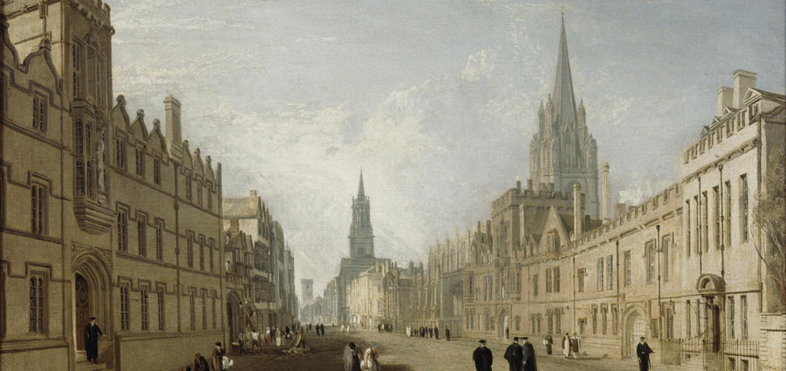

# topic
**note that this essay is introduction to a building, my input is very limited and the copy-pasting is excessive** I'm not proud of this, but I'm a student of engineering, this is harder than making me yap about 1984 and privacy .

- **Ashmolean Museum of Art and Archaeology**

> okay there's a [Old Ashmolean](https://en.wikipedia.org/wiki/History_of_Science_Museum,_Oxford) and [New Ashmolean](https://en.wikipedia.org/wiki/Ashmolean_Museum) one like wtf
>
> the characters in Babel probably visited the new one, but ehh it's outta scope
>
> so I guess i can include both? they are both Ashmolean museums.
> 
> how tf do i structure it?

# outline, not necessarily in the order:
1. history
   - can outline the culture then in 17th century and 19th century
     - such as why they built a new one and why someone built a museum to house their items in a university
   - how the building was built and why it was built
2. building
   - style of the building
   - choice of material
   - exterior
   - interior
3. items (since it's a museum)
   - anything interesting and major
     - like it's special and piece of its time
   - arts, sculpture, items of significance
4. thoughts
   - > 心得(?)
   - > I know the existence of this museum because of the book. So I guess this book is successful in various ways?
   - > Babel heheh oxford
5. references

# reading materials
- https://en.wikipedia.org/wiki/Ashmolean_Museum
- https://www.ashmolean.org/
  - https://ashmolean.org/about/

# misc draft i write

> **note that this is explicitly YOUR own output, not copy-pasting**

I read *Babel: Or the Necessity of Violence: An Arcane History of the Oxford Translators' Revolution* and was quite fascinated by Oxford itself. Since I have no other selection of buildings in mind, I picked this one that the main characters visited in the story.

The novel discussed the inequality in races using the main characters' interactions with the early 19th Oxford, England. The museum itself is a "stealing" from other cultures, just like how the young translators in the book was plucked from remote countries, only to use their mother language for the empire's prosperity. I'd imagine the author used this parallelism to show how out of place they are, just like the exotic exhibits in the museum.

# The Ashmolean museum

The Ashmolean is the University of Oxford’s museum of art and archaeology and is one of four University museums (along with the Museum of the History of Science, the Oxford University Museum of Natural History and the Pitt Rivers Museum). The four museums form part of the University's GLAM (Gardens, Libraries and Museums) group, together with the Bodleian Libraries and Botanic Gardens and Harcourt Arboretum. [[1]](https://ashmolean.org/about/)

# history

> the modification of copying and pasting begins

The Ashmolean came into existence in 1682, when the wealthy antiquary Elias Ashmole gifted his cabinet of curiosities to the University. It opened as Britain’s first public museum, and the world’s first university museum, in 1683.

Though the collection has evolved considerably, the founding principle remains: that knowledge of humanity across cultures and across times is important to society. A laudable intention, but the uncomfortable truth is that much of the collection was inevitably selected and obtained as a result of colonial power.

**John Tradescant and 'The Ark'**

Elias Ashmole acquired his collection from two gardeners: John Tradescant, father and son. Employed by the wealthy Earl of Salisbury, the Tradescants had travelled the world known to Europeans, shipping back new and exotic plant specimens for the Earl's gardens. In the course of their travels they also acquired a remarkable collection of botanical, geological and zoological items as well as man-made objects.

The Tradescant’s themselves established a museum in Lambeth, South London, known as ‘The Ark’ to house their collection in 1634. A visitor to this original museum commented that ‘a man might in one day behold…more curiosities than he should see if he spent all his life in travel.’ The collection contained treasures such as the ‘mantle’ (actually a wall hanging) of Pocahontas's father Powhatan, and the stuffed body of a dodo.

**Gifted to the University of Oxford**

When Ashmole gifted this collection to the University, it was combined with an older University collection, which included Guy Fawkes’s lantern and Jacob’s Coat of Many Colours (long since lost). The original Ashmolean Museum opened on Broad Street in 1683, in the building that is now the History of Science Museum (later known as the Old Ashmolean). Members of the public were admitted to the Ashmolean Museum from the outset (a controversial policy in the 17th century). Alongside the collection, this building was designed to house a chemistry laboratory and rooms for undergraduate lectures.

During the 18th century, an audit of the Ashmolean collections revealed the extent of decay and loss of original specimens. Most notably, the Tradescant’s famous dodo was in such an advanced state of decay it was considered beyond redemption and removed from display (today the head and one foot survive in the University Museum of Natural History). 

[Bryson, Bill (2003). A Short History of Nearly Everything (1st ed.). New York: Broadway Books, Random House, Inc. p. 470. ISBN 0-7679-0818-X. "In 1755, some seventy years after the last dodo's death, the director of the Ashmolean Museum in Oxford decided that the institution's stuffed dodo was becoming unpleasantly musty and ordered it tossed on a bonfire. This was a surprising decision as it was by this time the only dodo in existence, stuffed or otherwise. A passing employee, aghast, tried to rescue the bird but could save only its head and part of one limb."](https://en.wikipedia.org/wiki/Ashmolean_Museum#cite_ref-7)

**Changes and Expansion in the 1800s**

In 1820s the fortunes of the Ashmolean collections began to change under the reforming stewardship of brothers John and Philip Duncan. When the Ashmolean had first opened, the building in Broad Street was large enough for laboratories and lecture rooms which fulfilled the University’s requirements for the teaching of natural sciences. In the early 19th century the explosive development of these disciplines called for expanded facilities. This led, in 1860, to the University opening its second museum, on Parks Road, in the building that still remains the site of the University Museum of Natural History. The founding collection of this new museum was formed using surviving natural history specimens from the old Ashmolean collection.

This left the Ashmolean somewhat at a loss – a significant portion of the most important objects in the Museum were no longer there. Into this void stepped archaeologist Sir Arthur Evans, who became Keeper of the Ashmolean in 1884. In his 24-year keepership he transformed the museum by acquiring an internationally important archaeological collection. In 1894 he moved the collection from Broad Street to Beaumont Street behind the University Art Galleries and in 1908 the two institutions combined to create the current Ashmolean Museum of Art and Archaeology. Evans also arranged for the Bodleian’s collection of coins to form part of the Ashmolean collections in 1922, the core of which is now the Museum’s Heberden Coin Room.

The antiquities department expanded as a result of archaeological excavations across the United Kingdom and Europe, not least Evan’s discoveries at Knossos in Crete. Other significant collections came from Egypt and the Middle East where British colonial power enabled a significant division of objects between the foreign excavators and the country where they were dug up.

The standard of artworks also improved during this period thanks to gifts of paintings and drawings. An important collection of early Pre-Raphaelite works were donated in 1893 by Martha Combe, the widow of Thomas Combe who had been an early patron of the Brotherhood.

**The 20th Century**

The 20th century’s most significant acquisitions included the collections of the Indian Institute. Part museum, part training ground for prospective civil servants, the institute became redundant after Indian independence. Its collection formed the core of a new Eastern Art department. Up until then, all art had been part of the Fine Art department, which had prioritised Western traditions.

The newly independent Eastern department incorporated the Islamic world, the Indian subcontinent, South East Asia, Tibet, China, Korea and Japan, and gave these fields the prominence and scholarship that in turn encouraged further important donations. The Ashmolean today has the largest collection of Chinese greenware outside China and one of the finest collections of modern Chinese art in Europe.

In 1959 the collection of classical casts established itself as a separate department from antiquities. The departments as they currently stand – Western Art, Eastern Art, Antiquities, Cast Gallery and the Coin Room – inevitably reflect the areas of study prioritised in the past, but are now supplemented with collaborative projects with our university and community partners.

**Refurbishment and the Future**

The Ashmolean was refurbished in 2009, and opened to multiple-award-winning acclaim. The Ashmolean Director is Xa Sturgis.

[[cite]](https://www.ashmolean.org/history-ashmolean)

# items

## COIN

The Heberden Coin Room is one of the leading international coin cabinets with particular strengths in the fields of Greek, Roman, Celtic, Byzantine, Medieval, Islamic and Chinese coinages. It also holds collections of paper money, tokens, jettons and commemorative art medals.

[[cite]](https://www.ashmolean.org/heberden-coin-room)

- https://www.ashmolean.org/heberden-coin-room

## The Alfred's Jewel

One of the most popular exhibits in the Ashmolean museum: The Alfred Jewel, titled "Jewelled terminal of aestel" in the online Ashmolean collection archive, is a piece of Anglo-Saxon goldsmithing work made of enamel and quartz enclosed in gold.

This jewel was found while digging for peat in a moor in North Petherton, Somerset, in 1693. It is a masterpiece of goldsmith's work formed around a tear-shaped slice of polished quartz "rock crystal". The inscription in Old English around the sides: AELFRED MEC HEHT GEWYRCAN (Alfred ordered me to be made) most likely connects the jewel with the 9th-century King Alfred, known as Alfred the Great. 

Alfred ruled the southern Anglo-Saxon kingdom of Wessex and is famous for opposing the Vikings and unifying southern England. He is also credited with being a highly educated man, commissioning translations of religious texts from Latin into English. Some of these manuscripts were distributed to bishops throughout his kingdom and were accompanied by aestels, or pointers, used to follow the text as it was read. It is thought that the Alfred Jewel is one of these aestels. 

The dragon-like head at the base of the jewel holds in its mouth a cylindrical socket, within which the actual pointer – perhaps made of ivory – would have been held in place by a rivet. The figure represented in delicate colours in cloisonné enamel on a gold backplate protected by the rock crystal may represent the sense of sight, an appropriate image for an object intended to help with reading.
[[alfred 1]](https://collections.ashmolean.org/object/314562)

Although the function of the Jewel is not absolutely certain, it is believed to have been the handle or terminal for one of the precious "aestels" or staffs that Alfred the Great is recorded as having sent to each bishopric along with a copy of his Old English translation of Pope Gregory the Great's book *Pastoral Care*, which is a treatise on the responsibilities of the clergy written by Pope Gregory I around the year 590[[[cite]](https://en.wikipedia.org/wiki/Pastoral_Care). He wrote in his preface to the book:

"And I will send a copy to every bishop's see in my kingdom, and in each book there is an aestel of 50 mancusses and I command, in God's name, that no man take the staff from the book, nor the book from the church."

No other context is given in the preface, but in the context of books, the Old English word "aestel" can mean a "guide", "index", and also a "handle";[6] so, it is concluded that it meant a small pointer.
[[alfred wiki cite]](https://en.wikipedia.org/wiki/Alfred_Jewel#Function_and_commission)

The jewel was found only a few miles from Athelney Abbey, the stronghold in the marshes from which Alfred launched his counterattack on the Great Army of the Vikings. This ultimately led to his crucial military victory at Edington in 878 and the expansion of his authority across the southern half of England. 

[[alfred 1]](https://collections.ashmolean.org/object/314562)

- https://en.wikipedia.org/wiki/Alfred_Jewel#cite_ref-Object_2-11

## ART?

The museum also houses a collection of drawings by Michelangelo, Raphael and Leonardo da Vinci, paintings by Pablo Picasso, Giambattista Pittoni, Paolo Uccello, and more.

## Turner's High Street

Turner's High Street, Joseph Mallord William Turner (1775–1851), Oil on Canvas

Acknowledged as one of the greatest landscape artists of all time, Turner (1775–1851) knew Oxford extremely well and, from childhood, made numerous drawings of the streets and colleges and the picturesque views surrounding the city.

The painting is one of the most fully documented of all Turner’s works because Wyatt kept his correspondence with the artist which was included in his posthumous sale. The original purpose of the commission was to have the design engraved. Wyatt settled on an oil painting, instead of a watercolour, half the size of Turner’s normal canvases, at a cost of 100 guineas (a gold coin minted in Great Britain between 1663 and 1814, contained approximately one-quarter of an ounce of gold). The artist worked on the painting over the winter of 1809–10, consulting Wyatt on the details of the architecture included in the view. The final stage involved the introduction of figures, members of the University and clergy, and some women ‘for the sake of colour’. The painting was exhibited at the Royal Academy in 1812. When, in the 1830s, Turner was choosing views of Oxford for his greatest series of watercolours, he rejected the High Street. He felt that in this painting he had achieved an unparalleled view of technical mastery that he could not repeat.
[[cite]](https://www.ashmolean.org/turners-high-street)

On a personal touch, the high street was so prominent in the book *Babel*, it'll be a shame not to include this painting the essay. The High Street is the main artery of Oxford, connecting the major academic buildings and the commerce throughout the city. The characters experienced their daily lives and adventures  on this street, the painting is a helping hand for readers to imagine how Oxford looked like in the 19th century.

# old ashmolean

# mumbling

> isn't it essentially copy and pasting? so it's not like writing the 1984 report, 90% of the 1984 report are my words since I actually read the book and materials, and it requires a topic to be talked about. but this is just text finding. i guess it makes sense since it's introducing something, not discussing something.
>
> and the professor didn't explicitly stated what language I should write it in. i'm going to write it in english, since i failed to find an interesting chinese book to read this semester, all of the read i did was english :')
>
> I only managed to write the 1984 report in chinese because i read Red Roulette, my chinese wording training was at best spotty :')
>
> I guess this is a great opportunity to practice proper citing.
>
> surely if I do it little by little for 2 weeks i can achieve a lot of words like i did with the 1984 report. it was 3500 words, surely it's not that hard.

# reference

- ## cite1 
   https://ashmolean.org/about/
- ## cite2 
   MacGregor, A. (2001). The Ashmolean Museum. A brief history of the museum and its collections. Ashmolean Museum & Jonathan Horne Publications, London.
- ## cite3
   https://www.ashmolean.org/history-ashmolean
- ## cite4
  - https://collections.ashmolean.org/object/314562