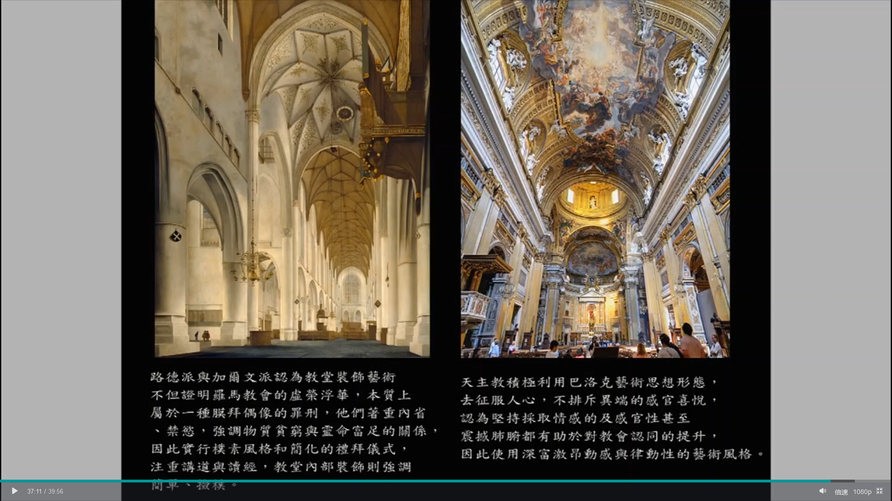

# requirement

- 600 words
- write it in chinese for health and prosperity :)
- or write it in english for the lol's

# outline?

1. history on arts
2. history on the east side of europe

1. religion
2. the masters
3. building
4. history of arts

- how the east and west came together in the form of arts
- how the cultures merged together from different national occupation in the form of arts 
- which is your favorite?

> bruh why is it so hard to write a good report about what I learned

# draft

宗教-藝術-人文-政治 <-歷史

This class gave me a perspective to see history from the side of arts and religion, which wasn't ever taught in systematic schools' history or art classes before. I guess it made sense for the arts and religion to be this closely weaved, considering most of the power and wealth were held by the leader of religion in a certain period of time, the religions bound people together and divided groups apart, the arts then connect the little pieces of history and put aside the differences of these groups. 

It's interesting to see how the Renaissance Italians called the medieval arts "Gothic," which was used as a synonym for "Barbaric," while preserving some characteristics of Gothic arts during their reign of the cities. How the Catholic or Christian churches has some elements of Islam arts. This shows again how art is neutral to ethnicity and religion.

Surprisingly, the most memorable thing I learned from this class is the biblical stories, symbolism, and characters. From how reiterated it was through out the history of art, it was not difficult to remember. It gave me an understanding of how the west sees the world, and how different it is from our own culture. Take the arts in Taiwanese temples as an example, it embodies the virtues of the Chinese culture, it tells you someone in the past did this, and you too should do it. However, the arts painted or sculpted at the interior or exterior of catholic or christian churches are more for the religion itself, it's more like advertisement that suggest you to join the churches and stay. It tells you what happens if you join or leave the church, what happened to the biblical figures, and what happens to the end of humanity if you're a member of the church.
> what even is the point you're trying to make here??

After looking at all these wonderful artworks from hundreds of years ago, it makes me wonder; wouldn't the sculptures and paintings about religious topics a form of fanart? The Bible being the original source of written work, and the arts being a recreation of the original written work. Different artists from different cultures have different art styles, but with the same passion, for art only or religion, they came together to create great arts to honor the religion (fandom?). In addition, people can commission their favorite artist to create art pieces. Even though I'm not an artist or a member of the community, but I think the 
> form of art??? business of art? has been the same way all this time, you can have big studio taking projects, and you can also have smaller artists doing what they like (?)
> 
> dude what?

My favorite part of the art history is how the artists use perspective techniques on painted walls to deceive the observers into thinking the actual ceiling is higher or the room is bigger. Especially the Church of St. Ignatius of Loyola, it's the first time I heard of painting a fake dome onto the flat ceiling to compensate the lack of funds. It's like the tourist attractions these days that have a painted floor with perspective illusion for photographing, making you look like you're about to be eaten by a shark in the photo. Not to mention the beautiful painted ceiling with the walls extended upwards into an opening to heaven, imagine having one in your own house, it would probably make a person's everyday mood better seeing such astounding artwork at all times.

> Sometimes I wish the Chinese artworks in the temples are more well-catalogued and preserved.
>
> dude what's your point?

My another favorite part of the art or religion history is how they sees math as a force of universe, thus a force of god. Math could explain everything in the form of an equation, and the artistic result is typically satisfying. 

> There's always a saying along the lines of "The ultimate boundary of science is metaphysics"
>
> what's the point?

Every time I see the videos of a town in Italy, it always reminds me of the Assassin's Creed II video game and how I scale the buildings as the in-game character. It's quite frankly my first acquaintance with the Renaissance Italy, the bulky red buildings for the functions or the white towering churches for the religion.

They let you climb the Cathedral of Saint Mary of the Flower in the video game, 